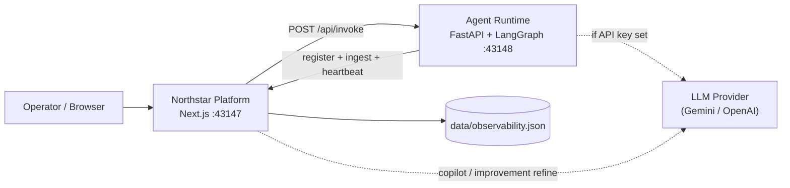
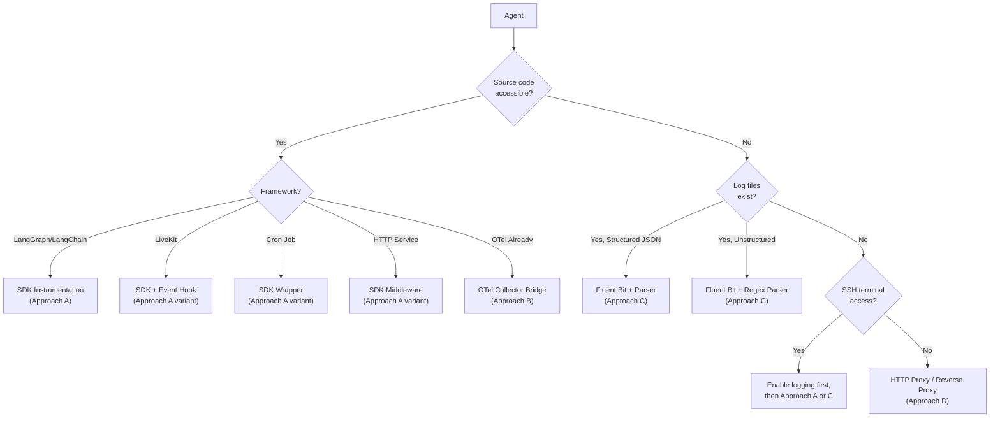
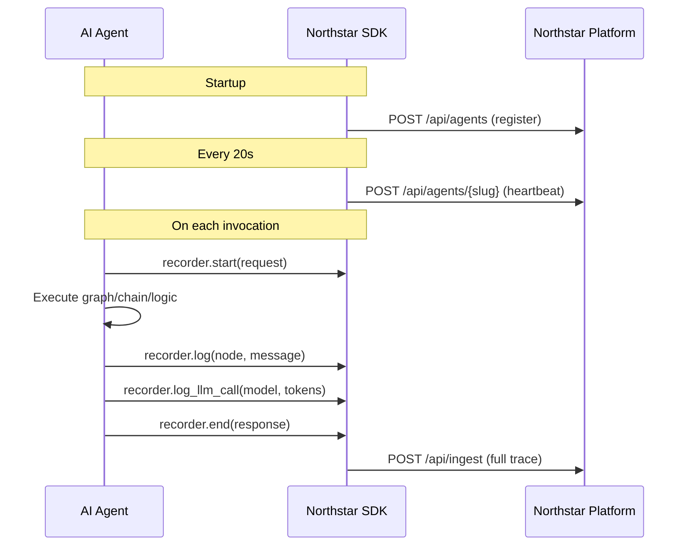
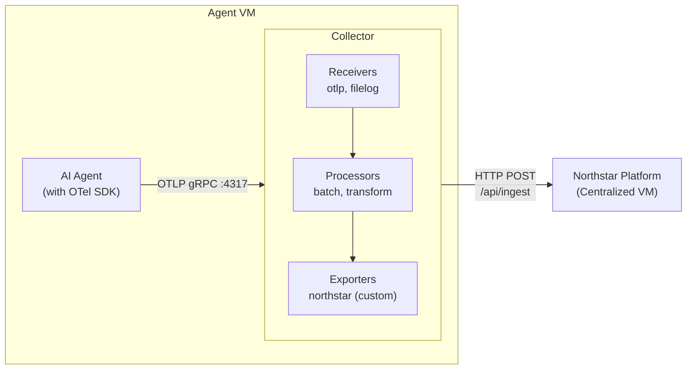
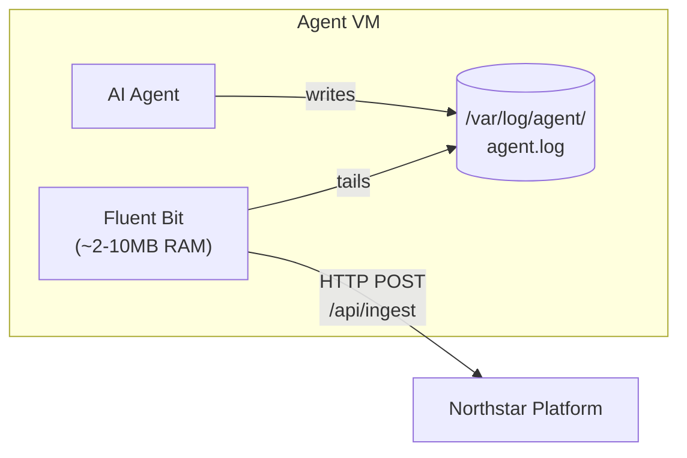
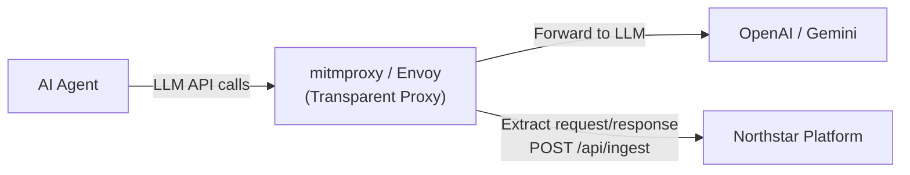
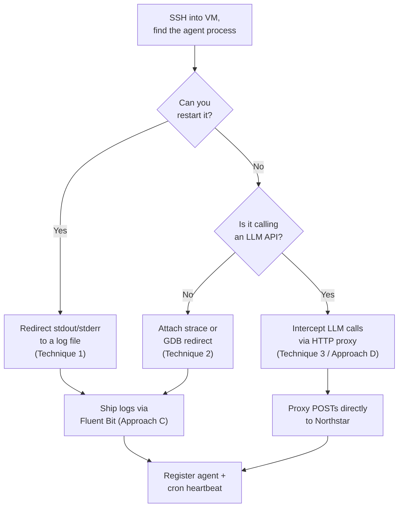
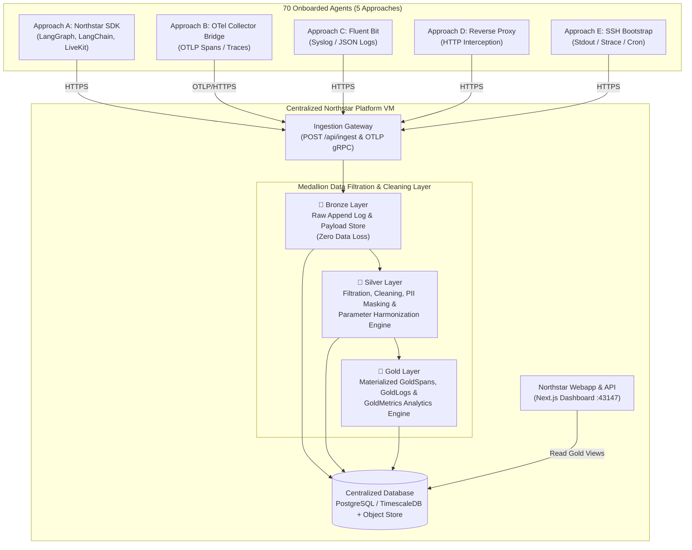
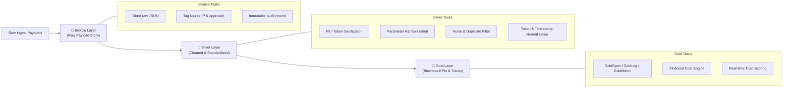
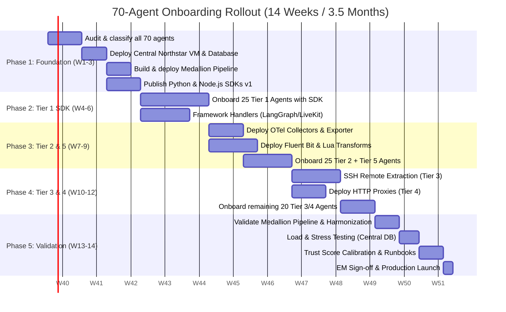

# Technical Proposal: Onboarding 70 AI Agents to Northstar Observability

**Author:** Engineering Team  
**Date:** 2026-09-17  
**Status:** Draft — Pending EM Review  
**Audience:** Engineering Manager, Platform Engineering, Agent Developers

---

## Executive Summary

We operate **70 AI agents** across multiple frameworks (LangGraph, LangChain, LiveKit, cron jobs, standalone services) deployed on **SSH-accessible VMs**. These agents vary wildly in:

- **Framework** — LangGraph, LangChain, LiveKit, raw Python/Node scripts, cron-scheduled jobs
- **Logging maturity** — some emit structured logs, some log to stdout, most have no logging at all
- **Access level** — some we can modify source code, some we can only access via SSH terminal, some are black boxes we can only observe externally

This proposal defines a **scenario-based onboarding strategy** to bring all 70 agents under the Northstar observability platform with **full-depth telemetry**: per-node traces, token counts, log streams, and trust scoring.

> [!IMPORTANT]
> The Northstar platform will be deployed as a **centralized instance on a dedicated VM**, accessible over the internal network. All agents push telemetry to it over HTTP.

---

## Table of Contents

1. [Current Platform Architecture](#1-current-platform-architecture)
2. [Ingest Contract — The Universal Interface](#2-ingest-contract--the-universal-interface)
3. [Agent Classification Matrix](#3-agent-classification-matrix)
4. [Onboarding Approaches](#4-onboarding-approaches)
5. [Scenario Playbooks](#5-scenario-playbooks)
6. [Centralized Deployment & Medallion Data Pipeline Architecture](#6-centralized-deployment--medallion-data-pipeline-architecture)
7. [SDK Design Specification](#7-sdk-design-specification)
8. [OTel Collector Configuration](#8-otel-collector-configuration)
9. [Fluent Bit Configuration](#9-fluent-bit-configuration)
10. [Registration & Discovery Automation](#10-registration--discovery-automation)
11. [Rollout Plan](#11-rollout-plan)
12. [Risk Matrix](#12-risk-matrix)
13. [Success Metrics](#13-success-metrics)

---

## 1. Current Platform Architecture

Northstar is currently a **local-first observability plane** for LLM agents:



### What Northstar Provides Today
| Capability | Description |
|:---|:---|
| **Fleet Dashboard** | Accuracy, confidence, trust KPIs per agent |
| **Trace Inspector** | Full request/response, per-node logs, latency, token usage |
| **Trust Scoring** | `0.40×accuracy + 0.30×confidence + 0.30×reliability` |
| **AI Suggestions** | Heuristic + LLM analysis → prompt/graph/tool patches |
| **Copilot** | Observability chat grounded in telemetry |
| **Audit Trail** | Immutable log of invocations, suggestions, operator actions |
| **AI Usage Tracking** | Model calls, tokens, cost per agent/node |

### What Needs to Change for 70-Agent Scale
| Area | Current | Required |
|:---|:---|:---|
| **Deployment** | localhost | Centralized VM, accessible over internal network |
| **Persistence** | Single JSON file | PostgreSQL + Object Store (recommended) |
| **Agent Integration** | Tightly-coupled Python `Recorder` class | Multi-language SDK + agentless options |
| **Network** | CORS open, localhost only | Internal network, API key auth, TLS |
| **Capacity** | 5 agents, ~265 traces | 70 agents, thousands of traces/day |

---

## 2. Ingest Contract — The Universal Interface

Every onboarding approach ultimately targets the same HTTP endpoint. This is the **universal interface** — regardless of how an agent is built, all telemetry flows through this contract:

### Endpoint
```
POST https://<northstar-host>/api/ingest
Content-Type: application/json
```

### Required Fields
| Field | Type | Description |
|:---|:---|:---|
| `request` | string | The input/prompt sent to the agent |
| `response` | string | The agent's output/response |
| `slug` or `agentId` | string | Identifies which agent produced this trace |

### Optional Fields (Full Depth)
| Field | Type | Description |
|:---|:---|:---|
| `systemPrompt` | string | System prompt snapshot at time of execution |
| `status` | `"ok"` \| `"error"` | Execution status |
| `accuracy` | number | Self-reported accuracy (0-100) |
| `confidence` | number | Self-reported confidence (0-100) |
| `error` | string | Error message if status is `"error"` |
| `logs[]` | array | Per-node structured log entries |
| `startedAt` | ISO-8601 | Trace start timestamp |
| `endedAt` | ISO-8601 | Trace end timestamp |
| `latencyMs` | number | Total execution time in milliseconds |
| `model` | string | LLM model used (e.g., `gemini-2.5-flash`) |
| `tokens.prompt` | number | Prompt token count |
| `tokens.completion` | number | Completion token count |
| `threadId` | string | Conversation/session thread ID |
| `degraded` | boolean | Whether the response was produced via fallback |

### Log Entry Schema
```json
{
  "ts": "2026-09-16T11:47:34.997Z",
  "level": "info",
  "node": "gather",
  "message": "Retriever returned 3 chunks",
  "data": { "ids": ["doc-1", "doc-2", "doc-3"] }
}
```

> [!TIP]
> The ingest API is the **only integration point**. Every approach described below is simply a different mechanism for constructing and delivering this payload.

---

## 3. Agent Classification Matrix

Before choosing an onboarding approach, each of the 70 agents must be classified along these axes:



### Classification Table

| Classification | Source Access | Logs Exist | Terminal Access | Recommended Approach | Estimated Count |
|:---|:---:|:---:|:---:|:---|:---:|
| **Tier 1 — Full Control** | ✅ | ✅ or can add | ✅ | SDK Instrumentation | ~25 |
| **Tier 2 — Log Files Available** | ❌ | ✅ | ✅ | OTel Collector or Fluent Bit | ~15 |
| **Tier 3 — Terminal Only** | ❌ | ❌ | ✅ | Enable logging, then Tier 1 or 2 | ~15 |
| **Tier 4 — Network Intercept** | ❌ | ❌ | ❌ | HTTP Proxy / API Gateway intercept | ~10 |
| **Tier 5 — OTel Native** | varies | varies | varies | OTel Collector Bridge | ~5 |

> [!NOTE]
> These counts are estimates. The first step of rollout (Week 1) is an **audit** to classify all 70 agents into these tiers.

---

## 4. Onboarding Approaches

### Approach A: Northstar SDK (Direct Instrumentation)

**Best for:** Agents where we have source code access (Tier 1).

This is the **gold standard** — it provides the deepest telemetry with the least ambiguity. The SDK is a lightweight library (Python and Node.js) that wraps around agent code.

#### Architecture



#### SDK API Surface (Python)

```python
from northstar_sdk import NorthstarClient, Recorder

# Initialize once at startup
client = NorthstarClient(
    northstar_url="https://northstar.internal:43147",
    api_key="ns_key_...",
)

# Register the agent
client.register(
    slug="my-agent",
    name="My LangChain Agent",
    description="Summarization agent for customer emails",
    role="summarization",
    version="1.3.0",
    system_prompt="You are a summarization assistant...",
    graph={"nodes": ["retrieve", "summarize", "score"], "edges": [...]},
)

# On each invocation
recorder = client.recorder(
    slug="my-agent",
    system_prompt="You are a summarization assistant...",
    model="gemini-2.5-flash",
)

recorder.log("Starting retrieval", node="retrieve")
# ... agent logic ...
recorder.log_llm_call(model="gemini-2.5-flash", prompt_tokens=1200, completion_tokens=350, node="summarize")
recorder.log("Summarization complete", node="summarize")

# Automatically constructs and POSTs the ingest payload
trace = recorder.ingest(
    request="Summarize the latest customer complaint",
    response="The customer reported...",
    accuracy=88.5,
    confidence=92.0,
)
```

#### SDK API Surface (Node.js / TypeScript)

```typescript
import { NorthstarClient } from '@northstar/sdk';

const client = new NorthstarClient({
  northstarUrl: 'https://northstar.internal:43147',
  apiKey: 'ns_key_...',
});

// Register
await client.register({
  slug: 'my-ts-agent',
  name: 'My TypeScript Agent',
  description: 'Code review agent',
  role: 'code_review',
  version: '2.0.0',
  systemPrompt: 'You are a code reviewer...',
  graph: { nodes: ['parse', 'analyze', 'score'], edges: [...] },
});

// On each invocation
const recorder = client.recorder({
  slug: 'my-ts-agent',
  systemPrompt: 'You are a code reviewer...',
  model: 'gemini-2.5-flash',
});

recorder.log('Parsing input', { node: 'parse' });
// ... agent logic ...
recorder.logLlmCall({ model: 'gemini-2.5-flash', promptTokens: 800, completionTokens: 200, node: 'analyze' });

const trace = await recorder.ingest({
  request: 'Review this pull request',
  response: 'Found 3 issues...',
  accuracy: 91,
  confidence: 88,
});
```

#### Framework-Specific Integrations

| Framework | Integration Pattern |
|:---|:---|
| **LangGraph** | Wrap `CompiledStateGraph.invoke()` — capture state at each node via a callback handler |
| **LangChain** | Custom `CallbackHandler` that maps `on_chain_start/end`, `on_llm_start/end` to `recorder.log()` / `recorder.log_llm_call()` |
| **LiveKit** | Hook into `AgentSession` lifecycle events — `on_user_speech`, `on_agent_response` |
| **CrewAI** | Wrap crew execution, map task completions to node logs |
| **AutoGen** | Intercept message passing between agents |
| **Raw Python** | Direct `recorder.log()` calls in business logic |

#### Trade-offs

| ✅ Strengths | ❌ Weaknesses |
|:---|:---|
| Deepest telemetry (graph topology, per-node logs, token counts) | Requires source code access |
| Framework-specific callback handlers auto-capture LLM calls | Must add dependency to each agent |
| Heartbeat keeps fleet status accurate | Code change required per agent |
| Self-reported accuracy/confidence enables trust scoring | — |

---

### Approach B: OpenTelemetry Collector Bridge

**Best for:** Agents already emitting OTel data, or agents where we want industry-standard instrumentation without custom SDK lock-in (Tier 5, or Tier 2 as upgrade path).

#### Architecture



#### Custom Northstar Exporter

The OTel Collector ships with standard exporters (OTLP, Jaeger, Prometheus), but Northstar's ingest schema is domain-specific (it expects `request`, `response`, `slug`). We need a **custom HTTP exporter** that transforms OTel spans into Northstar ingest payloads.

**Transformation Logic:**
```
OTel Span                          →  Northstar Ingest Field
─────────────────────────────────────────────────────────────
span.name                          →  log[].node
span.attributes["gen_ai.prompt"]   →  request
span.attributes["gen_ai.response"] →  response  
span.attributes["gen_ai.model"]    →  model
span.attributes["gen_ai.usage.prompt_tokens"]     → tokens.prompt
span.attributes["gen_ai.usage.completion_tokens"] → tokens.completion
resource.attributes["service.name"]               → slug
span.status.code == ERROR          →  status: "error"
span.events[]                      →  logs[]
span.start_time                    →  startedAt
span.end_time                      →  endedAt
```

#### OTel Collector Config (Per VM)

```yaml
receivers:
  otlp:
    protocols:
      grpc:
        endpoint: "0.0.0.0:4317"
      http:
        endpoint: "0.0.0.0:4318"
  
  filelog:
    include:
      - /var/log/agents/*.log
      - /var/log/agents/*.jsonl
    operators:
      - type: json_parser
        if: 'body matches "^\\{"'
      - type: regex_parser
        if: 'body matches "^\\d{4}"'
        regex: '^(?P<timestamp>\d{4}-\d{2}-\d{2}T\d{2}:\d{2}:\d{2})\s+(?P<level>\w+)\s+(?P<message>.*)'

processors:
  batch:
    timeout: 5s
    send_batch_size: 100
  
  resource:
    attributes:
      - key: deployment.environment
        value: production
        action: upsert
      - key: host.name
        from_attribute: host.name
        action: upsert

exporters:
  otlphttp/northstar:
    endpoint: "https://northstar.internal:43147/api/otel-ingest"
    headers:
      Authorization: "Bearer ns_key_..."

service:
  pipelines:
    traces:
      receivers: [otlp]
      processors: [batch, resource]
      exporters: [otlphttp/northstar]
    logs:
      receivers: [filelog]
      processors: [batch, resource]
      exporters: [otlphttp/northstar]
```

> [!WARNING]
> The OTel Collector bridge requires a **new API endpoint** on Northstar (`/api/otel-ingest`) that accepts OTLP format and transforms it to the internal ingest schema. This is additional platform development work.

#### Trade-offs

| ✅ Strengths | ❌ Weaknesses |
|:---|:---|
| Industry standard, vendor-neutral | Requires custom exporter development |
| Zero-code log collection via filelog receiver | OTel spans lack domain-specific fields (graph topology, trust scores) |
| Auto-instrumentation for Python/Node/Java | Transformation layer adds complexity |
| Works for agents already emitting OTel | New `/api/otel-ingest` endpoint needed on Northstar |
| OpAMP for remote collector management | Higher resource overhead than Fluent Bit |

---

### Approach C: Sidecar Log Shipper (Fluent Bit)

**Best for:** Agents that write log files but where we can't (or don't want to) modify source code (Tier 2).

#### Architecture



#### Fluent Bit Configuration

```ini
[SERVICE]
    Flush         5
    Log_Level     info
    HTTP_Server   On
    HTTP_Listen   0.0.0.0
    HTTP_PORT     2020

# ─── Structured JSON Logs ──────────────────────
[INPUT]
    Name          tail
    Tag           agent.structured
    Path          /var/log/agents/*-structured.jsonl
    Parser        json
    Refresh_Interval 5
    Mem_Buf_Limit 10MB

# ─── Unstructured Text Logs ────────────────────
[INPUT]
    Name          tail
    Tag           agent.unstructured
    Path          /var/log/agents/*-app.log
    Multiline     On
    Parser_Firstline  generic_timestamp
    Refresh_Interval  10
    Mem_Buf_Limit     10MB

# ─── Stdout/Stderr from systemd ────────────────
[INPUT]
    Name          systemd
    Tag           agent.systemd
    Systemd_Filter _SYSTEMD_UNIT=my-agent.service

# ─── Enrich with host metadata ─────────────────
[FILTER]
    Name          modify
    Match         agent.*
    Add           host_vm ${HOSTNAME}
    Add           environment production

# ─── Parse structured logs into ingest payload ─
[FILTER]
    Name          lua
    Match         agent.structured
    Script        /etc/fluent-bit/northstar_transform.lua
    Call          transform_to_ingest

# ─── Ship to Northstar ─────────────────────────
[OUTPUT]
    Name          http
    Match         agent.*
    Host          northstar.internal
    Port          43147
    URI           /api/ingest
    Format        json
    Header        Content-Type application/json
    Header        Authorization Bearer ns_key_...
    Retry_Limit   3
    tls           On
```

#### Lua Transform Script (`northstar_transform.lua`)

```lua
function transform_to_ingest(tag, timestamp, record)
    -- Attempt to map structured log fields to Northstar ingest schema
    local new_record = {}
    
    new_record["slug"] = record["agent_slug"] or record["service_name"] or "unknown-agent"
    new_record["request"] = record["input"] or record["prompt"] or record["request"] or ""
    new_record["response"] = record["output"] or record["response"] or record["completion"] or ""
    new_record["status"] = record["status"] or (record["error"] and "error" or "ok")
    new_record["error"] = record["error"]
    new_record["model"] = record["model"] or record["llm_model"]
    new_record["startedAt"] = record["started_at"] or record["timestamp"]
    new_record["endedAt"] = record["ended_at"]
    
    -- Token extraction
    if record["prompt_tokens"] or record["completion_tokens"] then
        new_record["tokens"] = {
            prompt = tonumber(record["prompt_tokens"]) or 0,
            completion = tonumber(record["completion_tokens"]) or 0,
        }
    end
    
    -- Wrap remaining fields as a log entry
    new_record["logs"] = {{
        ts = record["timestamp"] or os.date("!%Y-%m-%dT%H:%M:%SZ"),
        level = (record["level"] or "info"):lower(),
        node = record["node"] or record["step"],
        message = record["message"] or record["msg"] or "",
        data = {},
    }}
    
    return 1, timestamp, new_record
end
```

#### Trade-offs

| ✅ Strengths | ❌ Weaknesses |
|:---|:---|
| Zero code changes to agents | Shallowest data without structured logs |
| Extremely lightweight (~2-10MB RAM) | No graph topology awareness |
| Built-in retry, backpressure, buffering | Token counts only if parsed from logs |
| Handles stdout, files, systemd journal | Requires log format mapping per agent |
| Easy to deploy via Ansible/SSH | No heartbeat/registration (need separate script) |

---

### Approach D: HTTP Proxy Interception

**Best for:** Agents where we have no source access and no log files, but we know they make HTTP calls to an LLM provider (Tier 4).

#### Architecture



#### How It Works

1. **Deploy a transparent HTTP proxy** (e.g., `mitmproxy`, Envoy, or a lightweight Node reverse proxy) on the same VM as the agent
2. **Redirect the agent's LLM API traffic** through the proxy by setting `HTTP_PROXY` / `HTTPS_PROXY` environment variables, or by overriding the LLM API base URL
3. **The proxy intercepts** each LLM request/response pair, extracts:
   - The prompt (request body)
   - The completion (response body)
   - The model name
   - Token counts (from the API response)
4. **The proxy constructs** a Northstar ingest payload and POSTs it

#### Example: mitmproxy Addon Script

```python
"""mitmproxy addon that intercepts LLM API calls and forwards to Northstar."""
import json
import httpx
from mitmproxy import http

NORTHSTAR_URL = "https://northstar.internal:43147/api/ingest"
AGENT_SLUG = "intercepted-agent-name"
LLM_API_HOSTS = ["api.openai.com", "generativelanguage.googleapis.com"]

class NorthstarInterceptor:
    def response(self, flow: http.HTTPFlow):
        if flow.request.host not in LLM_API_HOSTS:
            return
        
        try:
            req_body = json.loads(flow.request.content)
            res_body = json.loads(flow.response.content)
            
            # Extract from OpenAI chat completions format
            messages = req_body.get("messages", [])
            prompt = messages[-1]["content"] if messages else ""
            system = next((m["content"] for m in messages if m["role"] == "system"), "")
            completion = res_body.get("choices", [{}])[0].get("message", {}).get("content", "")
            usage = res_body.get("usage", {})
            
            payload = {
                "slug": AGENT_SLUG,
                "request": prompt,
                "response": completion,
                "systemPrompt": system,
                "model": req_body.get("model", "unknown"),
                "tokens": {
                    "prompt": usage.get("prompt_tokens", 0),
                    "completion": usage.get("completion_tokens", 0),
                },
                "status": "ok" if flow.response.status_code == 200 else "error",
            }
            
            httpx.post(NORTHSTAR_URL, json=payload, timeout=5.0)
        except Exception:
            pass  # Don't break the proxy on parse failures
```

#### Trade-offs

| ✅ Strengths | ❌ Weaknesses |
|:---|:---|
| Zero code changes, zero log files needed | Only captures LLM API calls, not internal logic |
| Captures exact prompts and responses | Requires proxy setup per VM |
| Gets token counts from LLM API responses | TLS interception adds complexity |
| Works for any LLM-calling agent | No graph node awareness |
| | Privacy/security concerns with prompt interception |

---

### Approach E: SSH-Based Remote Log Extraction

**Best for:** Agents where we have SSH terminal access but no source code access and no existing log infrastructure (Tier 3 — as a bootstrapping step).

> [!IMPORTANT]
> **The core problem:** These agents have no logging code built into them. You can't just set `LOG_LEVEL=DEBUG` — that only works if the application already uses a logging framework (Python `logging`, `winston`, etc.) that reads that env var. If the agent never calls `logger.info(...)`, there's nothing to activate.

#### What We Actually Have to Work With

Even when an agent has zero intentional logging, the **process still produces observable side effects**:

| Observable Signal | What It Tells Us | How to Capture |
|:---|:---|:---|
| **stdout/stderr** | Print statements, uncaught exceptions, framework debug output | systemd journal, process output redirect |
| **Network traffic** | LLM API calls (prompts, completions, tokens) | HTTP proxy interception (Approach D) |
| **File I/O** | Input files read, output files written | `inotifywait` filesystem watcher |
| **Process lifecycle** | Start time, exit code, CPU/memory usage | `systemd` status, `/proc` filesystem |
| **Open file descriptors** | What files/sockets the process is using right now | `lsof -p <PID>` |

#### Technique 1: Capture stdout/stderr (Most Common)

Most agents print *something* — framework startup messages, Python tracebacks on errors, or LLM library debug output. The problem is usually that stdout goes to `/dev/null` or a terminal nobody is watching.

**Step 1 — Discover where output currently goes:**
```bash
ssh agent-vm-07

# Find the process
ps aux | grep -i agent
# PID = 12345

# Check where stdout/stderr are pointed
ls -la /proc/12345/fd/1  # stdout
ls -la /proc/12345/fd/2  # stderr
# If these point to /dev/null or a closed pipe, output is being discarded
```

**Step 2 — Redirect output to a file (requires process restart):**

If the agent runs via **systemd**:
```bash
sudo systemctl edit my-agent.service
```
Add this override:
```ini
[Service]
StandardOutput=append:/var/log/agents/my-agent-stdout.log
StandardError=append:/var/log/agents/my-agent-stderr.log
```
Then:
```bash
sudo mkdir -p /var/log/agents
sudo systemctl daemon-reload
sudo systemctl restart my-agent
```

If the agent runs via **crontab**:
```bash
# Change this:
*/5 * * * * /opt/agent/run.py

# To this:
*/5 * * * * /opt/agent/run.py >> /var/log/agents/my-agent.log 2>&1
```

If the agent runs as a **bare process** (started manually or via init script):
```bash
# Kill and restart with output capture
# (coordinate with the owning team first!)
/opt/agent/run.py 2>&1 | tee -a /var/log/agents/my-agent.log &
```

**Step 3 — Once logs exist, ship them** via Fluent Bit (Approach C).

#### Technique 2: Intercept Process Output Without Restart

If you **cannot restart the process**, you can attach to a running process to capture its future output:

```bash
# Option A: Use strace to intercept write() syscalls
# WARNING: Adds ~5-15% overhead. Use only for investigation, not permanent.
sudo strace -p 12345 -e trace=write -s 4096 -o /var/log/agents/my-agent-strace.log &

# Option B: Use GDB to redirect fd 1 (stdout) to a file (Linux only, one-shot)
sudo gdb -batch -p 12345 \
  -ex 'call (int)open("/var/log/agents/my-agent-stdout.log", 0102, 0644)' \
  -ex 'call (int)dup2($1, 1)' \
  -ex 'call (int)dup2($1, 2)' \
  -ex 'detach'
# This redirects stdout+stderr of a live process without restarting it
```

> [!WARNING]
> The GDB technique is powerful but risky — if the process is in the middle of a write, it can corrupt output. Use only on agents where a brief hiccup is acceptable.

#### Technique 3: Observe LLM API Calls (No Logs Needed)

If the agent makes HTTP calls to an LLM provider, you don't need logs at all — intercept the network traffic using **Approach D (HTTP Proxy)**. This is often the best option for Tier 3 agents:

```bash
# Check if the agent is calling an LLM API
sudo ss -tnp | grep 12345
# Look for connections to api.openai.com (port 443), generativelanguage.googleapis.com, etc.

# If you find LLM API calls, set up the proxy:
# Option A: Override the API base URL via environment variable
sudo systemctl edit my-agent.service
# Add: Environment="OPENAI_API_BASE=http://localhost:8080/v1"
# Then run a local proxy on port 8080 that forwards to OpenAI and also POSTs to Northstar

# Option B: If you can't set env vars, use iptables to redirect traffic
sudo iptables -t nat -A OUTPUT -p tcp -d api.openai.com --dport 443 -j REDIRECT --to-port 8080
```

#### Technique 4: Filesystem Observation (Passive)

Some agents read input files and write output files but don't log anything. Watch the filesystem:

```bash
# Install inotify-tools
sudo apt-get install inotify-tools

# Watch for file changes in the agent's working directory
inotifywait -m -r -e create,modify,close_write /opt/agent/data/ |
while read dir event file; do
    echo "$(date -u +%Y-%m-%dT%H:%M:%SZ) $event $dir$file" >> /var/log/agents/my-agent-fs.log
done &

# This tells you WHEN the agent runs and WHAT files it touches,
# even if it logs nothing
```

#### Technique 5: Cron-Based Telemetry Shipper (Minimal)

Once you've captured *any* output (via Techniques 1-4), ship it to Northstar:

```bash
#!/bin/bash
# /opt/northstar/ship-logs.sh — Runs every 5 minutes via cron
# Ships new log lines to Northstar

NORTHSTAR_URL="https://northstar.internal:43147/api/ingest"
AGENT_SLUG="remote-agent-name"
LOG_FILE="/var/log/agents/my-agent-stdout.log"
OFFSET_FILE="/var/log/agents/.northstar-offset"

# Read last offset
OFFSET=$(cat "$OFFSET_FILE" 2>/dev/null || echo "0")
CURRENT_SIZE=$(stat -c%s "$LOG_FILE" 2>/dev/null || echo "0")

if [ "$CURRENT_SIZE" -gt "$OFFSET" ]; then
    # Extract new lines
    NEW_CONTENT=$(tail -c +$((OFFSET + 1)) "$LOG_FILE" | head -c 5000)
    
    # Construct payload
    PAYLOAD=$(jq -n \
      --arg slug "$AGENT_SLUG" \
      --arg req "batch log ingest" \
      --arg res "$NEW_CONTENT" \
      '{slug: $slug, request: $req, response: ($res | .[0:5000]), status: "ok"}')
    
    curl -s -X POST "$NORTHSTAR_URL" \
        -H "Content-Type: application/json" \
        -d "$PAYLOAD"
    
    echo "$CURRENT_SIZE" > "$OFFSET_FILE"
fi
```

#### Decision Tree for Tier 3 Agents



#### Trade-offs

| ✅ Strengths | ❌ Weaknesses |
|:---|:---|
| Works when nothing else does | Manual, not scalable |
| No dependencies beyond bash + curl | Low fidelity — no structured traces |
| Good for initial discovery/audit | Requires per-agent SSH access |
| Bridges to proper instrumentation | Not real-time (cron delay) |

---

## 5. Scenario Playbooks

### Scenario 1: LangGraph/LangChain Agent with Source Access

| Property | Value |
|:---|:---|
| **Framework** | LangGraph or LangChain |
| **Source Access** | ✅ Yes |
| **Logging** | Can add |
| **Recommended Approach** | **Approach A — Northstar SDK** |
| **Effort** | ~2-4 hours per agent |
| **Telemetry Depth** | Full (graph topology, per-node traces, tokens, trust scores) |

#### Steps

1. **Install the SDK:**
   ```bash
   pip install northstar-observability-sdk
   ```

2. **Register the agent** at startup (add to the agent's entrypoint):
   ```python
   from northstar_sdk import NorthstarClient
   
   client = NorthstarClient(northstar_url="https://northstar.internal:43147")
   client.register(
       slug="my-langgraph-agent",
       name="My LangGraph Agent",
       graph={"nodes": [...], "edges": [...]},
       system_prompt="...",
   )
   client.start_heartbeat()  # Background thread, every 20s
   ```

3. **Add the LangGraph callback handler:**
   ```python
   from northstar_sdk.integrations.langgraph import NorthstarLangGraphHandler
   
   handler = NorthstarLangGraphHandler(client, slug="my-langgraph-agent")
   
   # Wrap the existing invoke call
   result = graph.invoke(
       {"input": user_input},
       config={"callbacks": [handler]},
   )
   # handler automatically captures per-node logs, LLM calls, and ingests the trace
   ```

4. **For LangChain agents**, use the LangChain-specific handler:
   ```python
   from northstar_sdk.integrations.langchain import NorthstarLangChainHandler
   
   handler = NorthstarLangChainHandler(client, slug="my-langchain-agent")
   chain.invoke({"input": user_input}, config={"callbacks": [handler]})
   ```

---

### Scenario 2: LiveKit Real-Time Agent

| Property | Value |
|:---|:---|
| **Framework** | LiveKit Agents SDK |
| **Source Access** | ✅ Yes |
| **Logging** | Can add |
| **Recommended Approach** | **Approach A — SDK with LiveKit hooks** |
| **Effort** | ~4-6 hours per agent |
| **Telemetry Depth** | Full (session-level, per-turn traces, STT/TTS/LLM token counts) |

#### Challenges Unique to LiveKit

- **Real-time streaming** — traces are not request/response pairs but continuous sessions
- **Multi-modal** — involves STT, LLM, TTS steps
- **Long-lived sessions** — a single "invocation" can last minutes

#### Steps

1. **Install SDK** and wrap the LiveKit `AgentSession`:
   ```python
   from northstar_sdk import NorthstarClient
   from northstar_sdk.integrations.livekit import NorthstarLiveKitPlugin
   
   client = NorthstarClient(northstar_url="https://northstar.internal:43147")
   
   # Register with a graph showing STT → LLM → TTS flow
   client.register(
       slug="my-livekit-agent",
       name="Voice Support Agent",
       graph={
           "nodes": ["stt", "llm", "tts", "tool_call"],
           "edges": [
               {"from": "START", "to": "stt"},
               {"from": "stt", "to": "llm"},
               {"from": "llm", "to": "tts"},
               {"from": "llm", "to": "tool_call"},
               {"from": "tool_call", "to": "llm"},
               {"from": "tts", "to": "END"},
           ],
       },
   )
   ```

2. **Hook into session lifecycle:**
   ```python
   plugin = NorthstarLiveKitPlugin(client, slug="my-livekit-agent")
   
   @plugin.on_turn_complete
   def handle_turn(turn_data):
       # Each conversational turn becomes a Northstar trace
       # turn_data: user_speech (request), agent_response (response),
       # stt_latency, llm_latency, tts_latency, token counts
       pass
   ```

3. **Map LiveKit events to Northstar log entries:**
   - `on_user_speech` → log entry with `node: "stt"`
   - `on_llm_response` → log entry with `node: "llm"` + token counts
   - `on_agent_speech` → log entry with `node: "tts"`
   - `on_function_call` → log entry with `node: "tool_call"`

---

### Scenario 3: Cron Job Agent

| Property | Value |
|:---|:---|
| **Framework** | Standalone script, scheduled via crontab |
| **Source Access** | ✅ Yes (usually a simple script) |
| **Logging** | Often logs to stdout, redirected to a file or nowhere |
| **Recommended Approach** | **Approach A — SDK Wrapper** |
| **Effort** | ~1-2 hours per agent |
| **Telemetry Depth** | Full per-execution trace |

#### Challenges Unique to Cron Jobs

- **No long-running process** — can't maintain heartbeat between executions
- **Exit on completion** — the "agent" is a script that runs and dies
- **Often no error handling** — failures are silent unless logged

#### Steps

1. **Wrap the cron script** with the SDK:
   ```python
   #!/usr/bin/env python3
   """My cron agent — runs every 15 minutes."""
   from northstar_sdk import NorthstarClient
   
   client = NorthstarClient(northstar_url="https://northstar.internal:43147")
   
   # Register on every run (upsert is idempotent)
   client.register(slug="daily-report-agent", name="Daily Report Generator")
   
   recorder = client.recorder(slug="daily-report-agent", model="gemini-2.5-flash")
   
   try:
       recorder.log("Starting daily report generation", node="init")
       
       # ... existing cron logic ...
       input_data = fetch_data()
       recorder.log(f"Fetched {len(input_data)} records", node="fetch")
       
       result = generate_report(input_data)
       recorder.log("Report generated", node="generate")
       
       trace = recorder.ingest(
           request=f"Generate daily report for {len(input_data)} records",
           response=result[:500],  # Truncate for the trace
           accuracy=95,
       )
   except Exception as e:
       recorder.ingest(
           request="Generate daily report",
           response="",
           status="error",
           error=str(e),
       )
       raise
   ```

2. **Update the crontab** to use the wrapped script:
   ```cron
   */15 * * * * /opt/agents/venv/bin/python /opt/agents/daily-report-wrapped.py >> /var/log/agents/daily-report.log 2>&1
   ```

3. **For heartbeat**, add a separate lightweight cron entry:
   ```cron
   * * * * * curl -s -X POST https://northstar.internal:43147/api/agents/daily-report-agent
   ```

---

### Scenario 4: Standalone Service (HTTP API)

| Property | Value |
|:---|:---|
| **Framework** | Flask, FastAPI, Express, etc. |
| **Source Access** | ✅ Yes |
| **Logging** | Application logs exist |
| **Recommended Approach** | **Approach A — SDK as Middleware** |
| **Effort** | ~2-3 hours per agent |
| **Telemetry Depth** | Full |

#### Steps

1. **Add SDK middleware** that wraps incoming requests:

   **FastAPI:**
   ```python
   from northstar_sdk.integrations.fastapi import NorthstarMiddleware
   
   app = FastAPI()
   app.add_middleware(NorthstarMiddleware, client=client, slug="my-api-agent")
   ```

   **Express.js:**
   ```javascript
   const { northstarMiddleware } = require('@northstar/sdk');
   
   app.use('/agent', northstarMiddleware({
     client,
     slug: 'my-express-agent',
     extractRequest: (req) => req.body.input,
     extractResponse: (res) => res.locals.agentOutput,
   }));
   ```

2. The middleware automatically:
   - Creates a `Recorder` per request
   - Captures request/response
   - Measures latency
   - Ingests the trace on response completion

---

### Scenario 5: Agent with Existing Log Files

| Property | Value |
|:---|:---|
| **Source Access** | ❌ No |
| **Logging** | ✅ Yes — writes to log files |
| **Terminal Access** | ✅ Yes |
| **Recommended Approach** | **Approach C — Fluent Bit** (if logs are well-structured) or **Approach B — OTel Collector** (for more transformation power) |
| **Effort** | ~3-5 hours per agent (mostly log format analysis + parser config) |
| **Telemetry Depth** | Medium — depends entirely on what the logs contain |

#### Decision: Fluent Bit vs OTel Collector

| Log Format | Recommendation |
|:---|:---|
| **JSON / JSONL with clear fields** (request, response, model, tokens) | Fluent Bit with Lua transform — simpler |
| **Unstructured text** (timestamp + level + message) | OTel Collector with regex parser — more powerful |
| **Multi-line stack traces** | OTel Collector filelog with multiline config |
| **Agent already has OTel** | OTel Collector with OTLP receiver |

#### Steps (Fluent Bit)

1. **Analyze the log format:**
   ```bash
   ssh agent-vm-03
   tail -100 /var/log/my-agent/app.log
   # Identify: JSON? Text? What fields exist?
   ```

2. **Create a field mapping** — document which log fields map to which Northstar ingest fields:
   ```
   Log field "query"        → Northstar "request"
   Log field "answer"       → Northstar "response"
   Log field "llm_model"    → Northstar "model"
   Log field "error_msg"    → Northstar "error"
   ```

3. **Write a Lua transform** specific to this agent's log format

4. **Deploy Fluent Bit** on the VM:
   ```bash
   # Install via package manager
   curl https://raw.githubusercontent.com/fluent/fluent-bit/master/install.sh | sh
   
   # Deploy config
   scp fluent-bit-agent03.conf agent-vm-03:/etc/fluent-bit/
   scp northstar_transform_agent03.lua agent-vm-03:/etc/fluent-bit/
   
   # Start as systemd service
   ssh agent-vm-03 "sudo systemctl enable fluent-bit && sudo systemctl start fluent-bit"
   ```

5. **Register the agent** separately (since Fluent Bit doesn't handle registration):
   ```bash
   curl -X POST https://northstar.internal:43147/api/agents \
     -H "Content-Type: application/json" \
     -d '{
       "slug": "legacy-agent-03",
       "name": "Legacy Summarization Agent",
       "description": "Agent on VM-03, monitored via log shipping",
       "role": "summarization",
       "version": "unknown"
     }'
   ```

---

### Scenario 6: Agent with No Logs, Terminal Access Only

| Property | Value |
|:---|:---|
| **Source Access** | ❌ No |
| **Logging** | ❌ No — stdout goes nowhere, no log files |
| **Terminal Access** | ✅ Yes (SSH) |
| **Recommended Approach** | **Approach E — SSH Bootstrap** → then **Approach C or D** |
| **Effort** | ~4-8 hours per agent (includes investigation + setup) |
| **Telemetry Depth** | Low initially, improves once logging is enabled |

#### Steps

> [!NOTE]
> For detailed techniques, see **Approach E** above. This is a summary of the workflow.

1. **SSH in and investigate** what the process actually outputs:
   ```bash
   ssh agent-vm-07
   
   # Find the agent process
   ps aux | grep -i agent
   # PID = 12345
   
   # Check where stdout/stderr currently go
   ls -la /proc/12345/fd/1  # stdout
   ls -la /proc/12345/fd/2  # stderr
   
   # Check if it's managed by systemd
   systemctl list-units | grep agent
   
   # Check what network connections it has (look for LLM API calls)
   sudo ss -tnp | grep 12345
   ```

2. **Choose a capture technique** based on what you find:

   | Finding | Technique |
   |:---|:---|
   | stdout/stderr → `/dev/null` and process can be restarted | Redirect via systemd override (Approach E, Technique 1) |
   | stdout/stderr → `/dev/null` but process **cannot** be restarted | Attach GDB or strace (Approach E, Technique 2) |
   | Process makes LLM API calls (connections to `api.openai.com` etc.) | HTTP proxy interception (Approach E, Technique 3 / Approach D) |
   | Process reads/writes data files but outputs nothing | Filesystem watcher with `inotifywait` (Approach E, Technique 4) |

3. **Once any output is captured**, deploy Fluent Bit (Approach C) to ship logs to Northstar

4. **If the agent makes LLM API calls**, deploy the HTTP proxy (Approach D) — this gives you the richest data (actual prompts, responses, token counts) without needing the agent to log anything

---

### Scenario 7: Agent with No Logs AND No Terminal Access

| Property | Value |
|:---|:---|
| **Source Access** | ❌ No |
| **Logging** | ❌ No |
| **Terminal Access** | ❌ No |
| **Recommended Approach** | **Approach D — HTTP Proxy Interception** at the network level |
| **Effort** | ~8-12 hours per agent (network reconfiguration required) |
| **Telemetry Depth** | Low-Medium (LLM calls only) |

> [!CAUTION]
> This is the hardest scenario. Without any access to the agent itself, we can only observe its network behavior.

#### Steps

1. **Identify the agent's LLM API calls** at the network level:
   - Check firewall rules / security groups for outbound traffic to `api.openai.com`, `generativelanguage.googleapis.com`, etc.
   - Use network monitoring tools on the VM's host/hypervisor

2. **Deploy a transparent proxy / API gateway** between the agent and the LLM provider:
   ```
   Agent VM → Internal DNS Override → Proxy VM → LLM API
   ```
   - Override DNS resolution for `api.openai.com` to point to the proxy
   - Or configure the network gateway to redirect LLM API traffic

3. **The proxy captures** request/response pairs and forwards to Northstar

4. **Register the agent** manually:
   ```bash
   curl -X POST https://northstar.internal:43147/api/agents \
     -H "Content-Type: application/json" \
     -d '{
       "slug": "blackbox-agent-12",
       "name": "Blackbox Agent 12",
       "description": "No access. Monitored via network interception only.",
       "role": "unknown",
       "version": "unknown"
     }'
   ```

> [!IMPORTANT]
> **Escalation path:** For Tier 4 agents, the recommendation is to **request source access or terminal access** from the responsible team. Network interception should be a temporary measure, not a permanent solution.

---

### Scenario 8: Agent Already Emitting OpenTelemetry

| Property | Value |
|:---|:---|
| **Framework** | Any (already has OTel SDK integrated) |
| **Source Access** | May or may not have |
| **OTel Emitting** | ✅ Yes — emitting OTLP traces/logs |
| **Recommended Approach** | **Approach B — OTel Collector Bridge** |
| **Effort** | ~2-3 hours per agent |
| **Telemetry Depth** | Medium-High (depends on what OTel attributes they emit) |

#### Steps

1. **Deploy OTel Collector** on the same VM (or point to a central collector):
   ```bash
   # Install OTel Collector Contrib
   wget https://github.com/open-telemetry/opentelemetry-collector-releases/releases/download/v0.103.0/otelcol-contrib_0.103.0_linux_amd64.deb
   sudo dpkg -i otelcol-contrib_*.deb
   ```

2. **Configure the collector** to receive OTLP and export to Northstar (see Approach B config above)

3. **Point the agent's OTLP endpoint** to the local collector:
   ```bash
   export OTEL_EXPORTER_OTLP_ENDPOINT="http://localhost:4317"
   ```

4. **Map OTel semantic conventions** to Northstar fields via the custom exporter

---

## 6. Centralized Deployment & Medallion Data Pipeline Architecture

To onboard all 70 agents—which vary widely in framework, log maturity, and payload structure—into a single observability pane, Northstar utilizes a **centralized architecture** backed by a **single unified database** and a **Medallion Data Pipeline (Bronze → Silver → Gold)** for data filtration, cleaning, and parameter harmonization.



---

### 6.1 Centralized Storage & Single Database Strategy

Regardless of whether telemetry originates from an SDK-instrumented LangGraph agent, a Fluent Bit log shipper, an HTTP proxy, or an SSH stdout tail, **all data flows into a single centralized database instance** co-located with or connected to the Northstar VM.

- **Primary Database**: PostgreSQL with TimescaleDB extension for hyper-table time-series indexing.
- **Object Storage**: S3-compatible local bucket (MinIO or cloud storage) for raw prompt/response payload snapshots exceeding 100KB.
- **Unified Querying**: The Northstar Webapp UI (`/src/obs-ui`, Next.js API routes) reads exclusively from unified materialized views in this central database.

---

### 6.2 Medallion Architecture Data Pipeline (Bronze → Silver → Gold)

Because the 70 agents use different logging formats and field parameter names (e.g., `prompt` vs `input` vs `user_query`), telemetry cannot be blindly inserted into analytical tables. Northstar applies a **3-tier Medallion Data Pipeline** to clean, filter, and normalize all incoming telemetry:



#### 🥉 1. Bronze Layer (Raw Ingestion & Storage)
- **Purpose**: Raw intake buffer. Retains exact, un-altered incoming payloads from all 5 onboarding approaches to ensure zero data loss.
- **Table Schema**: `bronze_telemetry_raw`
  - `id` (UUID, Primary Key)
  - `agent_slug` (VARCHAR) — Identifier of the submitting agent
  - `source_approach` (ENUM: `SDK`, `OTEL_COLLECTOR`, `FLUENT_BIT`, `REVERSE_PROXY`, `SSH_BOOTSTRAP`)
  - `raw_payload` (JSONB) — Full raw JSON body or syslog string
  - `ingested_at` (TIMESTAMPTZ UTC) — Server timestamp when packet arrived
  - `source_ip` (INET) — VM IP address of sender
  - `headers_json` (JSONB) — HTTP request headers (user agent, API key ID)

#### 🥈 2. Silver Layer (Data Filtration, Cleaning & Parameter Harmonization)
- **Purpose**: Asynchronous cleaning worker process that validates, sanitizes, and harmonizes heterogeneous agent logs into standard normalized structures.
- **Key Pipeline Operations**:

1. **Filtration & Noise Reduction**:
   - **Heartbeat & Ping Suppression**: Filters out healthcheck logs and duplicate periodic ping frames from cron agents.
   - **Dead Letter Queue (DLQ)**: Routes corrupt/unparseable JSON payloads to `silver_dead_letter_queue` for operator inspection.

2. **Sanitization & PII Masking**:
   - Automatically redacts authorization tokens, API keys (`sk-[a-zA-Z0-9]{32,}`, `Bearer eyJ...`), passwords, SSNs, and credit card numbers using high-performance regex masks before storage.

3. **Parameter Harmonization (Cross-Framework Mapping)**:
   Different agent frameworks and custom scripts emit different parameter names for identical concepts. The Silver cleaning layer normalizes parameter names into Northstar standard fields:

   | Concept | Incoming Parameter Variations Across 70 Agents | Harmonized Northstar Standard Field |
   |:---|:---|:---|
   | **Input Prompt** | `prompt`, `input`, `user_query`, `content`, `message`, `query`, `input_text` | `request` |
   | **Output Response** | `response`, `output`, `answer`, `result`, `completion`, `output_text` | `response` |
   | **LLM Model** | `llm_model`, `model_name`, `engine`, `gen_ai.request.model`, `model` | `model` |
   | **Agent Identifier** | `slug`, `agentId`, `agent_name`, `service.name`, `app_id` | `slug` |
   | **Latency / Duration** | `duration`, `duration_ms`, `elapsed`, `response_time`, `latency` | `duration_ms` |
   | **Tokens (Input)** | `prompt_tokens`, `input_tokens`, `gen_ai.prompt_tokens` | `gen_ai_input_tokens` |
   | **Tokens (Output)** | `completion_tokens`, `output_tokens`, `gen_ai.completion_tokens` | `gen_ai_output_tokens` |
   | **Trace / Request ID** | `trace_id`, `requestId`, `correlation_id`, `run_id` | `trace_id` |

4. **Type Normalization & Fallbacks**:
   - Converts all timestamps to ISO-8601 UTC.
   - If token counts are missing from raw logs, applies character-length token estimation fallback: `estTokens(text) = ceil(len(text) / 4)`.

- **Table Schemas**: `silver_normalized_spans`, `silver_normalized_logs`, `silver_normalized_metrics`.

#### 🥇 3. Gold Layer (Business Analytics, Trust Scoring & Dashboard Models)
- **Purpose**: High-performance materialized analytics layer designed specifically to feed the Northstar Webapp UI (`/src/obs-ui`) and dashboard APIs.
- **Codebase Data Model Alignment**: Directly implements the runtime structures in `src/lib/dash-gold.ts`:

```typescript
// Gold Analytical Models (Matching Northstar Engine)
export interface GoldSpan {
  trace_id: string;
  span_id: string;
  parent_span_id: string | null;
  span_name: string;
  span_kind: string;
  start_time: string;
  end_time: string;
  duration_ms: number;
  status_code: "ok" | "error";
  status_message: string | null;
  service_name: string;
  agent_name: string;
  conversation_id: string;
  model: string | null;
  gen_ai_input_tokens: number;
  gen_ai_output_tokens: number;
  llm_cost_total_usd: number;   // Calculated via priceForModel()
  input_text: string | null;
  output_text: string | null;
  attributes_json: string;
  project_id: string;
  source_platform: string;
  ingested_at: string;
  is_tool: boolean;
}

export interface GoldLog {
  timestamp: string;
  service_name: string;
  environment: string;
  severity: "DEBUG" | "INFO" | "WARN" | "ERROR";
  message: string;
  trace_id: string;
  span_id: string;
  project_id: string;
}

export interface GoldMetric {
  timestamp: string;
  service_name: string;
  project_id: string;
  environment: string;
  category: string;
  metric_type: string;
  value: number;
  response_code: string | null;
  response_code_class: string | null;
  state: string | null;
  readiness_status: string | null;
  hist_count: number | null;
  hist_min: number | null;
  hist_max: number | null;
}
```

- **Calculated Gold Business Attributes**:
  - **Financial Cost Engine**: Computes exact USD cost per trace using input/output token pricing lookup (`priceForModel()`).
  - **Trust Score Engine**: Calculates continuous agent trust index: `0.40 × accuracy + 0.30 × confidence + 0.30 × reliability`.
  - **Fleet Aggregations**: Pre-aggregates p50/p95/p99 latency, error rates, model breakdown, and tool usage frequencies.

---

### 6.3 Network Requirements & Security

| From | To | Port | Protocol | Purpose |
|:---|:---|:---:|:---|:---|
| Agent VMs | Northstar VM | 43147 | HTTPS | Ingest, registration, heartbeat |
| Operator Workstation | Northstar VM | 43147 | HTTPS | Dashboard UI |
| Northstar VM | Agent VMs | varies | HTTPS | Invoke proxy (optional) |

### 6.4 Authentication & Access Control

1. **API Key Authentication** — each agent/VM receives a unique `ns_key_...` token passed as `Authorization: Bearer` header.
2. **Agent-specific keys** enable full audit trail attribution: tracking which VM/agent submitted telemetry.
3. **Key rotation** managed via Northstar admin panel.

---

## 7. SDK Design Specification

### Package Structure

```
northstar-observability-sdk/
├── python/
│   ├── northstar_sdk/
│   │   ├── __init__.py          # NorthstarClient, Recorder
│   │   ├── client.py            # HTTP client, registration, heartbeat
│   │   ├── recorder.py          # Trace recording, log collection
│   │   └── integrations/
│   │       ├── langgraph.py     # LangGraph callback handler
│   │       ├── langchain.py     # LangChain callback handler
│   │       ├── livekit.py       # LiveKit session hooks
│   │       ├── fastapi.py       # FastAPI middleware
│   │       ├── flask.py         # Flask middleware
│   │       └── crewai.py        # CrewAI task hooks
│   ├── pyproject.toml
│   └── tests/
├── node/
│   ├── src/
│   │   ├── index.ts             # NorthstarClient, Recorder
│   │   ├── client.ts
│   │   ├── recorder.ts
│   │   └── integrations/
│   │       ├── langchain.ts
│   │       ├── express.ts
│   │       └── fastify.ts
│   ├── package.json
│   └── tests/
└── README.md
```

### Key Design Decisions

| Decision | Choice | Rationale |
|:---|:---|:---|
| **Transport** | HTTP POST (not gRPC, not WebSocket) | Matches existing ingest API; works through firewalls; simplest |
| **Retry** | 3 attempts with exponential backoff | Mirrors existing `telemetry.py` behavior |
| **Heartbeat** | Background thread/interval, every 20s | Keeps fleet status accurate without blocking agent |
| **Buffering** | None (fire-and-forget per trace) | Simplicity; traces are typically small (<10KB) |
| **Dependencies** | `httpx` (Python), `undici`/`fetch` (Node) | Minimal dependency footprint |
| **Thread Safety** | Each `Recorder` instance is single-invocation | No shared mutable state; safe for concurrent use |

---

## 8. OTel Collector Configuration

### Custom Northstar Exporter

The custom exporter is implemented as an OTel Collector plugin (Go):

```
otel-northstar-exporter/
├── exporter.go              # Main exporter logic
├── config.go                # Configuration struct
├── factory.go               # Factory registration
├── transform.go             # OTLP → Northstar payload transformation
└── go.mod
```

### Transformation Rules

| OTel Attribute | Northstar Field | Notes |
|:---|:---|:---|
| `resource["service.name"]` | `slug` | Must match a registered agent |
| `span["gen_ai.prompt"]` | `request` | OpenAI semantic convention |
| `span["gen_ai.completion"]` | `response` | OpenAI semantic convention |
| `span["gen_ai.request.model"]` | `model` | |
| `span["gen_ai.usage.prompt_tokens"]` | `tokens.prompt` | |
| `span["gen_ai.usage.completion_tokens"]` | `tokens.completion` | |
| `span.name` | `logs[].node` | Each span becomes a log entry |
| `span.status.code == ERROR` | `status: "error"` | |
| `span.events[].name` | `logs[].message` | Span events become log entries |
| `resource["deployment.environment"]` | (metadata only) | For filtering in future |

### New Platform Endpoint: `/api/otel-ingest`

A new API route on Northstar that accepts OTLP HTTP format and performs the transformation server-side (alternative to a custom collector exporter):

```
POST /api/otel-ingest
Content-Type: application/x-protobuf (or application/json)

# Accepts standard OTLP ExportTraceServiceRequest
# Transforms internally to Northstar ingest format
# Returns standard OTLP ExportTraceServiceResponse
```

---

## 9. Fluent Bit Configuration

### Deployment Automation (Ansible)

```yaml
# ansible/roles/fluent-bit/tasks/main.yml
- name: Install Fluent Bit
  apt:
    name: fluent-bit
    state: present

- name: Deploy agent-specific config
  template:
    src: "fluent-bit-{{ agent_slug }}.conf.j2"
    dest: /etc/fluent-bit/fluent-bit.conf
  notify: restart fluent-bit

- name: Deploy Lua transform script
  template:
    src: "northstar_transform_{{ agent_slug }}.lua.j2"
    dest: /etc/fluent-bit/northstar_transform.lua
  notify: restart fluent-bit

- name: Ensure Fluent Bit is running
  systemd:
    name: fluent-bit
    state: started
    enabled: yes

- name: Register agent with Northstar
  uri:
    url: "https://northstar.internal:43147/api/agents"
    method: POST
    body_format: json
    body:
      slug: "{{ agent_slug }}"
      name: "{{ agent_name }}"
      description: "{{ agent_description }}"
      role: "{{ agent_role | default('unknown') }}"
      version: "{{ agent_version | default('unknown') }}"
```

---

## 10. Registration & Discovery Automation

### Agent Inventory File

Maintain a single source of truth for all 70 agents:

```yaml
# agents-inventory.yml
agents:
  # ─── Tier 1: Full Control ──────────────────────
  - slug: atlas-research
    name: Atlas Research
    vm: agent-vm-01
    framework: langgraph
    tier: 1
    approach: sdk
    source_repo: git@github.com:org/atlas-agent.git
    role: research
    version: 2.1.0
    
  - slug: helix-support
    name: Helix Support
    vm: agent-vm-01
    framework: langgraph
    tier: 1
    approach: sdk
    source_repo: git@github.com:org/helix-agent.git
    role: support
    version: 2.1.0

  # ─── Tier 2: Log Files Available ───────────────
  - slug: legacy-summarizer
    name: Legacy Summarization Agent
    vm: agent-vm-03
    framework: unknown
    tier: 2
    approach: fluent-bit
    log_path: /var/log/legacy-summarizer/app.jsonl
    log_format: json
    role: summarization

  # ─── Tier 3: Terminal Only ─────────────────────
  - slug: batch-classifier
    name: Batch Classifier
    vm: agent-vm-07
    framework: raw-python
    tier: 3
    approach: ssh-bootstrap
    process_name: batch_classifier.py
    role: classification

  # ─── Tier 4: Network Intercept ─────────────────
  - slug: blackbox-agent-12
    name: Vendor Agent 12
    vm: agent-vm-09
    framework: unknown
    tier: 4
    approach: proxy
    llm_provider: openai
    role: unknown

  # ─── Tier 5: OTel Native ──────────────────────
  - slug: otel-agent-01
    name: OTel-Instrumented Agent
    vm: agent-vm-05
    framework: langchain
    tier: 5
    approach: otel-collector
    otel_endpoint: localhost:4317
    role: qa
```

### Bulk Registration Script

```python
#!/usr/bin/env python3
"""Register all agents from inventory file."""
import yaml
import httpx

NORTHSTAR_URL = "https://northstar.internal:43147"

with open("agents-inventory.yml") as f:
    inventory = yaml.safe_load(f)

for agent in inventory["agents"]:
    resp = httpx.post(f"{NORTHSTAR_URL}/api/agents", json={
        "slug": agent["slug"],
        "name": agent["name"],
        "description": f"Tier {agent['tier']} agent on {agent['vm']} ({agent['framework']})",
        "role": agent.get("role", "unknown"),
        "version": agent.get("version", "unknown"),
    })
    status = "✅" if resp.status_code == 200 else "❌"
    print(f"{status} {agent['slug']}: {resp.status_code}")
```

---

## 11. Rollout Plan (3.5-Month Schedule)

The onboarding of all 70 agents is structured across a **14-week (3.5-month)** phased rollout. This timeframe ensures robust foundation building, thorough agent audit, incremental tier-by-tier onboarding, validation of the Medallion Data Pipeline, and extensive load testing.



### Phased Weekly Milestones

| Phase | Weeks | Milestone & Deliverables | Cumulative Agents Onboarded |
|:---:|:---:|:---|:---:|
| **Phase 1** | **W1–W3** | **Platform Foundation & Data Pipeline**: Dedicated Northstar VM set up; Central PostgreSQL + TimescaleDB & MinIO deployed; Bronze/Silver/Gold Medallion pipeline configured; Python & Node.js SDKs v1 published; all 70 agents audited & classified. | **0 / 70** |
| **Phase 2** | **W4–W6** | **Tier 1 SDK Instrumentation**: Integrate Northstar SDK into all 25 source-accessible agents (LangGraph, LangChain, LiveKit); verify per-node traces, STT/TTS audio turn metrics, and prompt snapshots. | **25 / 70** |
| **Phase 3** | **W7–W9** | **Tier 2 & Tier 5 Log & OTel Ingestion**: Deploy OTel Collector & custom exporter to 5 OTel-native VMs; deploy Fluent Bit & Lua parameter harmonization scripts to 20 log-emitting VMs. | **50 / 70** |
| **Phase 4** | **W10–W12** | **Tier 3 & Tier 4 Bootstrapping & Proxies**: Execute SSH-based remote extraction (stdout tee, strace, inotify) for 15 terminal-only agents; deploy transparent HTTP reverse proxies for 5 black-box agents. | **70 / 70** |
| **Phase 5** | **W13–W14** | **Enterprise Validation & Governance**: Validate Silver-layer parameter harmonization accuracy across all 70 streams; execute 10k trace/day load tests; calibrate Gold-layer Trust Scoring formula; publish operator runbooks; EM final sign-off. | **70 / 70 ✅** |

---

## 12. Risk Matrix

| Risk | Likelihood | Impact | Mitigation |
|:---|:---:|:---:|:---|
| **Northstar single-instance bottleneck** at 70-agent scale | Medium | High | Horizontal scaling plan; PostgreSQL persistence; batch ingest support |
| **Network connectivity** — agents can't reach Northstar VM | Medium | High | Local buffering in SDK (queue + retry); Fluent Bit built-in retry |
| **Log format diversity** — each agent logs differently | High | Medium | Per-agent Lua transforms; document log schemas during audit |
| **Tier 4 agents** — proxy interception breaks TLS | Medium | Medium | Use env var override (`OPENAI_API_BASE`) where possible; avoid MitM |
| **SDK adoption resistance** — agent owners don't want to add dependency | Medium | Medium | Provide drop-in decorators; demonstrate value on first agent; EM mandate |
| **Token count gaps** — not all approaches capture token counts | High | Low | Northstar already estimates tokens from response length as fallback |
| **Stale heartbeats** — cron jobs die, heartbeat stops | Medium | Low | Northstar already handles offline/degraded status transitions |
| **Data volume** — JSON store can't handle thousands of traces | High | High | Migrate to PostgreSQL in Week 1-2 (already planned in HLD) |

---

## 13. Success Metrics

| Metric | Target | Measurement |
|:---|:---|:---|
| **Agent visibility** | 70/70 agents registered on dashboard | Fleet page shows all agents |
| **Heartbeat coverage** | >90% of agents have heartbeat <5min old | Health page, heartbeat staleness |
| **Trace ingestion** | >95% of agent invocations produce a trace | Compare known invocation count vs trace count |
| **Full-depth traces** | >60% of traces include per-node logs and token counts | Trace inspector completeness |
| **Trust score coverage** | 100% of agents have a computed trust score | Fleet page trust column |
| **Mean time to onboard** | <4 hours per Tier 1 agent, <8 hours per Tier 2-5 | Engineering time tracking |
| **Platform uptime** | >99.5% availability | Health endpoint monitoring |
| **Ingest latency** | p99 <500ms (SDK to trace appearing in UI) | Platform metrics |

---

## Appendix A: Approach Decision Matrix

Use this table to determine the right approach for any new agent:

| | **SDK (A)** | **OTel Collector (B)** | **Fluent Bit (C)** | **HTTP Proxy (D)** | **SSH Bootstrap (E)** |
|:---|:---:|:---:|:---:|:---:|:---:|
| Source code access required | ✅ | ❌ | ❌ | ❌ | ❌ |
| Agent code changes needed | ✅ | ❌ (if OTel already) | ❌ | ❌ | ❌ |
| Log files required | ❌ | ✅ (or OTel) | ✅ | ❌ | ❌ |
| Terminal access required | ❌ | ✅ | ✅ | ❌ | ✅ |
| Graph topology captured | ✅ | ⚠️ Partial | ❌ | ❌ | ❌ |
| Per-node logs captured | ✅ | ✅ | ⚠️ If structured | ❌ | ❌ |
| Token counts captured | ✅ | ✅ | ⚠️ If in logs | ✅ | ❌ |
| Trust scoring depth | Full | Medium | Low | Medium | Low |
| Heartbeat support | ✅ Built-in | ❌ Separate | ❌ Separate | ❌ Separate | ❌ Separate |
| Setup effort (per agent) | 2-4h | 2-3h | 3-5h | 8-12h | 4-8h |
| Ongoing maintenance | Low | Medium | Medium | High | High |

---

## Appendix B: Quick Reference — Minimum Viable Ingest

For any agent, the absolute minimum to appear on the Northstar dashboard:

```bash
# 1. Register the agent (one-time)
curl -X POST https://northstar.internal:43147/api/agents \
  -H "Content-Type: application/json" \
  -d '{"slug": "my-agent", "name": "My Agent"}'

# 2. Send a trace (on each invocation)
curl -X POST https://northstar.internal:43147/api/ingest \
  -H "Content-Type: application/json" \
  -d '{
    "slug": "my-agent",
    "request": "User asked: What is the weather?",
    "response": "The weather in NYC is 72F and sunny."
  }'

# 3. Heartbeat (every 20s, keeps status "online")
curl -X POST https://northstar.internal:43147/api/agents/my-agent
```

That's it. Everything else (logs, tokens, accuracy, graph topology) is additive depth.

---

## Appendix C: Glossary

| Term | Definition |
|:---|:---|
| **Trace** | A single agent invocation record (request → response + metadata) |
| **Ingest** | The act of sending a trace to Northstar via `POST /api/ingest` |
| **Registration** | Declaring an agent's identity, graph topology, and system prompt to Northstar |
| **Heartbeat** | Periodic `POST /api/agents/{slug}` to signal the agent is alive |
| **Trust Score** | Composite metric: `0.40*accuracy + 0.30*confidence + 0.30*reliability` |
| **Slug** | URL-safe identifier for an agent (e.g., `atlas-research`) |
| **Recorder** | SDK class that collects logs during an invocation and submits the trace |
| **Tier** | Classification of agent accessibility (1=full control, 4=no access) |

---

*This document is a living proposal. Sections will be updated as the audit reveals the actual distribution of agent tiers and as SDK development progresses.*
