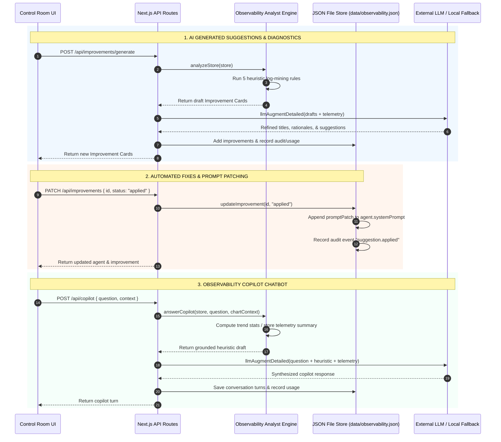

# AI Suggestions, Automated Fixes, & Copilot Architecture — Northstar Observability

This document details the mechanics, algorithms, data flows, and code locations of the **AI Observability System** in Northstar. It explains how the platform generates automated suggestions, applies system prompt fixes, and powers the conversational Copilot chatbot.

---

## 1. Meta-AI Architecture Overview

In addition to running operational agents (LangGraph fleet), Northstar includes a **Meta-AI engine** ("AI Inspecting AI"). The control plane continuously monitors agent execution logs, error rates, and quality metrics to suggest architecture improvements, patch system prompts, and answer operator questions.



---

## 2. AI Generated Suggestions (Observability Analyst)

### Overview
Suggestions are generated either on-demand (when an operator clicks **Analyze Logs** in `/suggestions`) or automatically when a runtime trace fails.

### Trigger Sources & Code Paths
1. **On-Demand Generation**: `POST /api/improvements/generate` ([src/app/api/improvements/generate/route.ts](file:///c:/Users/LuC/Downloads/agent-ops/src/app/api/improvements/generate/route.ts))
2. **Auto-Generation on Trace Error**: `autoImproveOnError()` in [src/lib/store.ts](file:///c:/Users/LuC/Downloads/agent-ops/src/lib/store.ts#L447-L477)

### Step 1: Heuristic Log Mining (`analyzeStore`)
The core diagnostic algorithm resides in `analyzeStore()` ([src/lib/observability-agent.ts](file:///c:/Users/LuC/Downloads/agent-ops/src/lib/observability-agent.ts#L16-L120)). It inspects stored agent metrics and recent traces using 5 rule-based checks:

```
┌────────────────────────────────────────────────────────────────────────────────────────┐
│                              ANALYST LOG MINING RULES                                  │
├──────────────────┬─────────────────────────────┬───────────────────────────────────────┤
│ Rule Target      │ Trigger Condition           │ Generated Improvement Category        │
├──────────────────┼─────────────────────────────┼───────────────────────────────────────┤
│ Error Spike      │ Error Rate ≥ 15%            │ Category: Reliability (Severity: High)│
│                  │ (recentErrors.length ≥ 1)   │ Suggests adding retry/fallback nodes. │
├──────────────────┼─────────────────────────────┼───────────────────────────────────────┤
│ Over-Confidence  │ Calibration Gap > 12 pts    │ Category: Evaluation (Severity: Med)  │
│ Gap              │ (Confidence - Accuracy)     │ Suggests capping score node values.   │
├──────────────────┼─────────────────────────────┼───────────────────────────────────────┤
│ Low Accuracy     │ Avg Accuracy < 75           │ Category: Evaluation (Severity: Med)  │
│                  │ (traces ≥ 2)                │ Suggests tightening evaluation rubric.│
├──────────────────┼─────────────────────────────┼───────────────────────────────────────┤
│ Missing Citation │ Research answers lacking    │ Category: Prompt (Severity: Med)      │
│                  │ source_id / citation links  │ Suggests mandatory citation rule.     │
├──────────────────┼─────────────────────────────┼───────────────────────────────────────┤
│ Vague / Short    │ Multiple OK traces returning│ Category: Tooling (Severity: Low)     │
│ Answers          │ response length < 80 chars  │ Suggests expanding retrieve loop.     │
└──────────────────┴─────────────────────────────┴───────────────────────────────────────┘
```

### Step 2: LLM Refinement Pass (`llmAugmentDetailed`)
After heuristic drafts are collected, `POST /api/improvements/generate` sends the drafts to `llmAugmentDetailed()` to refine prose quality:

- **Prompt Construction**:
  ```text
  Given this agent telemetry JSON, refine these improvement drafts. Keep titles.
  Return the same number of items as JSON array with keys title, rationale, suggestion.
  Drafts: <JSON of ideas>
  Agents: <JSON of active system prompts & graphs>
  Recent errors: <JSON of last 8 error traces>
  ```
- **Fallback Guarantee**: If the LLM provider times out or API keys are missing, `llmAugmentDetailed()` returns the heuristic draft directly (`fallback: true`). The endpoint parses the JSON response and merges refined fields into final improvement cards.

### Step 3: Persistence & Audit
New improvements are written to `data/observability.json` via `addImprovements()`. Each suggestion creates an immutable audit trail entry (`action: "analyst.run"` or `"suggestion.created"`) and tracks LLM token expenditure in `store.usages`.

---

## 3. Automated Fixes & System Prompt Patching

### Overview
Improvements follow a four-state lifecycle: `open` $\rightarrow$ `accepted` $\rightarrow$ `applied` $\rightarrow$ `dismissed`.

```
          ┌──────────┐
          │   open   │
          └────┬─────┘
               │
       ┌───────┴───────┐
       ▼               ▼
┌────────────┐   ┌───────────┐
│  accepted  │   │ dismissed │
└──────┬─────┘   └───────────┘
       │
       ▼
┌────────────┐
│  applied   │  ──► System Prompt Updated & Saved
└────────────┘
```

### Code Implementation (`updateImprovement`)
When an operator clicks **Apply prompt patch** in the UI, a `PATCH /api/improvements` request is sent with `{ id, status: "applied" }`.

The update is handled by `updateImprovement()` in [src/lib/store.ts](file:///c:/Users/LuC/Downloads/agent-ops/src/lib/store.ts#L479-L505):

```typescript
export function updateImprovement(id: string, status: Improvement["status"], actor = "operator") {
  return mutate((store) => {
    const item = store.improvements.find((i) => i.id === id);
    if (!item) return null;
    item.status = status;
    item.actor = actor;
    
    // PROMPT PATCHING INJECTION
    if (status === "applied" && item.promptPatch) {
      const agent = store.agents.find((a) => a.id === item.agentId);
      if (agent && !agent.systemPrompt.includes(item.promptPatch)) {
        agent.systemPrompt = `${agent.systemPrompt.trim()}\n\n${item.promptPatch}`;
        item.appliedAt = new Date().toISOString();
      }
    }
    
    // AUDIT LEDGER RECORDING
    if (status !== "open") {
      pushAudit(store, {
        action: `suggestion.${status}`,
        actor,
        agentId: item.agentId,
        suggestionId: item.id,
        summary: `${status}: ${item.title}`,
      });
    }
    return item;
  });
}
```

### How Fixes Take Effect Across the Runtime
1. **State Persistence**: The updated `agent.systemPrompt` is written atomically to `data/observability.json`.
2. **Runtime Execution**: When subsequent graph invocations occur, `POST /api/invoke` proxies requests to the Python runtime (`agents/app/server.py`).
3. **Agent Ingestion**: The agent graph executes using the updated system prompt, immediately enforcing the new rules (e.g., citation requirement or stricter policy guidelines).

---

## 4. Observability Copilot Chatbot Architecture

### Overview
The Copilot is a conversational interface (`/copilot`) that allows operators to query fleet performance, investigate error logs, examine system prompts, and analyze dashboard chart trends.

### End-to-End Execution Flow (`POST /api/copilot`)

```
User Query + Dashboard Context
             │
             ▼
 ┌──────────────────────┐
 │  answerCopilot()     │  ◄── 1. Deterministic Analysis
 └───────────┬──────────┘      - Chart Trends (explainFromPayload)
             │                 - Fleet Metrics & Trust Rankings
             ▼                 - Error Log Extraction
 ┌──────────────────────┐
 │ llmAugmentDetailed() │  ◄── 2. LLM Synthesis Pass
 └───────────┬──────────┘      - System Prompt: "Do not invent metrics"
             │                 - Provider: Gemini / OpenAI / Local
             ▼
 ┌──────────────────────┐
 │   Store & Ledger     │  ◄── 3. Audit & Token Ingestion
 └──────────────────────┘      - Save conversation turn
                               - Record AI usage token spend
```

### Step 1: Grounded Telemetry Analytics (`answerCopilot`)
Before calling any LLM, `answerCopilot()` ([src/lib/observability-agent.ts](file:///c:/Users/LuC/Downloads/agent-ops/src/lib/observability-agent.ts#L338-L410)) performs keyword and heuristic matching against stored state:

1. **Dashboard Chart Payload Analysis (`explainFromPayload`)**:
   If the query references UI charts, `explainFromPayload()` parses raw chart data (time windows, series values, P50 vs P95 latency spreads, cost spikes, error frequencies) and generates statistical summaries.
2. **Trust & Score Queries**:
   Calculates accuracy, confidence, trust scores, and identifies the lowest-performing agent.
3. **Error Log Extraction**:
   Extracts recent failure logs, error messages, and failing node names.
4. **Prompt & Improvement Queries**:
   Fetches active agent system prompts or lists open improvement cards.

### Step 2: System Prompt & LLM Augmentation
The heuristic answer and telemetry context are passed to `llmAugmentDetailed()` with a strict system instruction:

```text
System Prompt:
"You are an observability engineer for LangGraph agents. Be specific. Cite trace ids and node names when present. Do not invent metrics."

Prompt:
Answer the operator. Use only provided telemetry. Heuristic draft:
<Heuristic draft from answerCopilot>

Telemetry:
<JSON containing Agents, last 15 Traces, Open Improvements>
```

### Step 3: Provider Fallbacks & Token Accounting
- **Gemini / OpenAI Execution**: Attempts `callGemini()` (`gemini-2.5-flash`) first, followed by `callOpenAI()` (`gpt-4o-mini`).
- **Local Fallback**: If no key is set or execution exceeds 20 seconds, returns the heuristic draft (`model: "local-analyst"`).
- **Ledger Ingestion**: The conversation turns are saved to `store.copilot`, and usage metadata (prompt tokens, completion tokens, latency, provider) is logged into `store.usages`.

---

## 5. Summary Table: Code Map of Meta-AI Components

| Functionality | Primary File / Code Location | Key Functions |
| --- | --- | --- |
| **Log Mining & Rules** | [src/lib/observability-agent.ts](file:///c:/Users/LuC/Downloads/agent-ops/src/lib/observability-agent.ts#L16-L120) | `analyzeStore()` |
| **Chart Analytics** | [src/lib/observability-agent.ts](file:///c:/Users/LuC/Downloads/agent-ops/src/lib/observability-agent.ts#L177-L298) | `explainFromPayload()`, `seriesStats()` |
| **Copilot Engine** | [src/lib/observability-agent.ts](file:///c:/Users/LuC/Downloads/agent-ops/src/lib/observability-agent.ts#L338-L410) | `answerCopilot()` |
| **Dual-LLM Caller** | [src/lib/observability-agent.ts](file:///c:/Users/LuC/Downloads/agent-ops/src/lib/observability-agent.ts#L423-L518) | `callGemini()`, `callOpenAI()`, `llmAugmentDetailed()` |
| **Generate Endpoint** | [src/app/api/improvements/generate/route.ts](file:///c:/Users/LuC/Downloads/agent-ops/src/app/api/improvements/generate/route.ts) | `POST()` |
| **Fix / Patch Endpoint** | [src/app/api/improvements/route.ts](file:///c:/Users/LuC/Downloads/agent-ops/src/app/api/improvements/route.ts) | `PATCH()` |
| **Copilot Endpoint** | [src/app/api/copilot/route.ts](file:///c:/Users/LuC/Downloads/agent-ops/src/app/api/copilot/route.ts) | `POST()`, `GET()` |
| **Store Mutator & Patch**| [src/lib/store.ts](file:///c:/Users/LuC/Downloads/agent-ops/src/lib/store.ts#L479-L505) | `updateImprovement()`, `autoImproveOnError()` |
