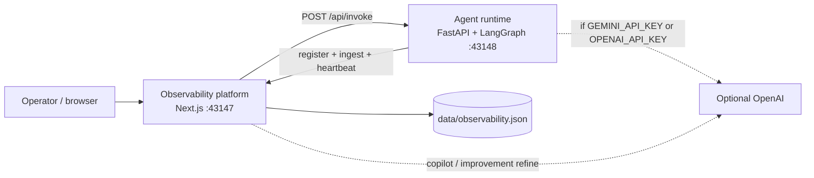
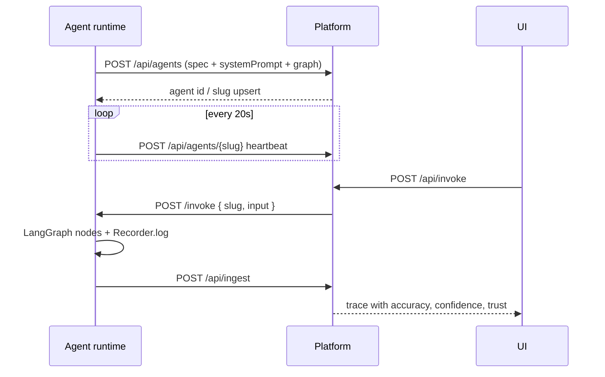

# High-level design — Northstar Agent Observability

## 1. Purpose

Northstar is a local observability plane for LLM agents. It records every run (prompt, request, response, node logs, and quality scores), computes a **trust** signal, and runs a **platform-side agent** that proposes graph/prompt patches from failures.

It is designed to run on a laptop with two processes and no required cloud credentials.

## 2. Context diagram



## 3. Logical components

| Component | Responsibility |
| --- | --- |
| **Control room UI** | Fleet KPIs, agent detail (system prompt + scores), trace inspector, improvements, copilot, invoke playground |
| **Ingest API** | Authenticated-optional HTTP intake for traces; CORS open for local agents |
| **Registry** | Agent onboard: slug, graph topology, system prompt, version, heartbeat |
| **Scoring service** | Accuracy / confidence derivation and trust blend |
| **Observability agent** | Heuristic (+ optional LLM) analysis of logs → improvement cards and chat answers |
| **LangGraph fleet** | Four compiled graphs with a shared `Recorder` that emits logs per node |

## 4. Agent onboarding flow



## 5. Scoring model

Trust is not a marketing number. It is an operational composite:

```
trust = 0.40 * accuracy
      + 0.30 * confidence
      + 0.30 * reliability
```

- **Accuracy** prefers the graph’s score node; otherwise the platform estimates from response structure, hedges, and error status.
- **Confidence** prefers the score node; errors collapse it.
- **Reliability** is the success rate of the last 25 traces for that agent. A failed run heavily discounts the reliability term.

This keeps an agent that is “sure but often wrong” from looking trustworthy.

## 6. Agentic observability

The dashboard is not only a viewer:

1. **Analyze logs** (`POST /api/improvements/generate`) clusters error traces, low accuracy, missing citations, and short answers, then writes improvement cards (prompt, graph, tooling, evaluation, reliability).
2. **Copilot** (`POST /api/copilot`) answers operator questions from the same store. With `GEMINI_API_KEY` (preferred) or `OPENAI_API_KEY` it refines the heuristic draft; without a key it still answers from telemetry.
3. **Playground** executes a live graph so new evidence appears immediately.

## 7. Data store

A single JSON document at `data/observability.json` holds agents, traces, improvements, and copilot turns. The choice is intentional for local-first operation: zero extra services, easy to inspect, easy to delete.

For production, replace the store with Postgres (traces) + an object store (prompt snapshots) without changing the ingest contract.

## 8. Deployment topology (local)

| Script | Process | Port |
| --- | --- | --- |
| `./run-observability.sh` | `next dev` | `43147` (`PORT`) |
| `./run-agents.sh` | `uvicorn app.server:app` | `43148` (`AGENTS_PORT`) |

The agent runtime retries registration for ~60s so boot order is flexible.

## 9. Quality attributes

- **Offline capable** — deterministic LangChain/LangGraph paths when no API key is set.
- **Explainable traces** — every node writes a log line; the score node writes the numbers the UI shows.
- **Fail visible** — Sentinel’s correlate node times out on known phrases so reliability work is demoable.
- **Replaceable LLMs** — `app/llm.py` is the only OpenAI boundary on the agent side.

## 10. Out of scope (this slice)

Multi-tenant auth, OpenTelemetry exporters, durable queues, and online eval workers. The ingest schema is small enough to fan out to those later.
