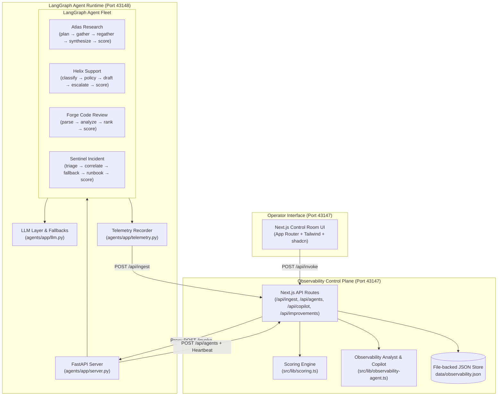

# Comprehensive Interview Q&A & Architecture Guide — Northstar Agent Observability

This document is a technical reference and interview preparation guide for the **Northstar Agent Observability** project (`agent-ops`). It details the system architecture, code organization, AI usage patterns, guardrails, reliability mechanisms, and includes 20+ interview questions with answer briefs.

---

## 1. System Architecture Overview

Northstar is a local-first control room and observability plane designed for monitoring, evaluating, and self-healing multi-agent systems built with **LangGraph**, **FastAPI**, **Next.js**, and **TypeScript**.



### Core Architecture Highlights
1. **Two-Process Local Architecture**:
   - **Observability Plane**: Next.js (Port `43147`) handles trace storage, scoring, log analysis, prompt patching, and dashboard views.
   - **Agent Runtime**: FastAPI + Python (Port `43148`) executes compiled LangGraph state machines.
2. **Zero-Dependency Fallback**: Fully functional without external API keys via local deterministic fallback logic. When `GEMINI_API_KEY` or `OPENAI_API_KEY` is present, it seamlessly routes calls to LLM providers.
3. **Decoupled Telemetry Ingestion**: Every LangGraph node invocation records execution events via a context-aware `Recorder` and POSTs structured telemetry back to the observability plane.

---

## 2. Codebase Map: Which Part of Code Does What

### Python Agent Runtime (`agents/app/`)

| File / Directory | Line Count / Exports | Primary Responsibility |
| --- | --- | --- |
| [agents/app/server.py](file:///c:/Users/LuC/Downloads/agent-ops/agents/app/server.py) | ~151 lines | FastAPI entrypoint. Handles agent auto-onboarding loop, periodic heartbeats (20s), thread-pool execution for `/invoke`, and error wrapping. |
| [agents/app/llm.py](file:///c:/Users/LuC/Downloads/agent-ops/agents/app/llm.py) | ~93 lines | Unified LLM execution layer. Supports Gemini (`gemini-2.5-flash`), OpenAI (`gpt-4o-mini`), and deterministic fallback. Bounded by 25s timeout and tracks token usage via Python `contextvars`. |
| [agents/app/telemetry.py](file:///c:/Users/LuC/Downloads/agent-ops/agents/app/telemetry.py) | ~113 lines | `Recorder` class used inside LangGraph runs to log node steps, capture token usages, compute execution latency, and post traces to `/api/ingest`. |
| [agents/app/tools.py](file:///c:/Users/LuC/Downloads/agent-ops/agents/app/tools.py) | ~133 lines | Mock tool infrastructure: knowledge base retriever (`retrieve_evidence`), policy rules (`lookup_policy`), intent classifier, SLO metrics snapshot, and CWE static code scanner (`scan_code`). |
| [agents/app/graphs/research.py](file:///c:/Users/LuC/Downloads/agent-ops/agents/app/graphs/research.py) | ~126 lines | **Atlas Research**: 5-node graph (`plan` → `gather` → conditional `regather` → `synthesize` → `score`). Enforces citation source IDs. |
| [agents/app/graphs/support.py](file:///c:/Users/LuC/Downloads/agent-ops/agents/app/graphs/support.py) | ~118 lines | **Helix Support**: 5-node graph (`classify` → `policy` → `draft` → conditional `escalate` → `score`). Enforces refund/credit policy and human escalation. |
| [agents/app/graphs/code_review.py](file:///c:/Users/LuC/Downloads/agent-ops/agents/app/graphs/code_review.py) | ~96 lines | **Forge Code Review**: 4-node graph (`parse` → `analyze` → `rank` → `score`). Runs CWE static vulnerability scanning and ranks residual risks. |
| [agents/app/graphs/incident.py](file:///c:/Users/LuC/Downloads/agent-ops/agents/app/graphs/incident.py) | ~143 lines | **Sentinel Incident**: 5-node graph (`triage` → `correlate` → conditional `fallback` → `runbook` → `score`). Implements SLO cached snapshot fallback and `abort-runbook` fail-closed path. |

### Next.js Observability & Control Plane (`src/lib/` & `src/app/`)

| File / Directory | Responsibility |
| --- | --- |
| [src/lib/store.ts](file:///c:/Users/LuC/Downloads/agent-ops/src/lib/store.ts) | JSON file-backed persistence (`data/observability.json`). Atomic file writes (`*.tmp` + rename), seed data backfilling, and trace/audit capping. |
| [src/lib/scoring.ts](file:///c:/Users/LuC/Downloads/agent-ops/src/lib/scoring.ts) | Trust engine calculation. Computes accuracy, calibration confidence, historical 25-trace reliability, and combined Trust Score. |
| [src/lib/observability-agent.ts](file:///c:/Users/LuC/Downloads/agent-ops/src/lib/observability-agent.ts) | Agentic observability analyst. Scans traces for error spikes (≥15%), calibration gaps (>12 pts), and missing citations, generating actionable Improvement Cards and powering Copilot chat. |
| [src/app/api/ingest/route.ts](file:///c:/Users/LuC/Downloads/agent-ops/src/app/api/ingest/route.ts) | Ingest endpoint. Receives trace payloads from Python runtime, computes trust scores, and updates store. |
| [src/app/api/improvements/route.ts](file:///c:/Users/LuC/Downloads/agent-ops/src/app/api/improvements/route.ts) | Suggestions lifecycle endpoint. Supports accepting, dismissing, and **applying prompt patches** directly to registered agent system prompts. |
| [src/app/api/copilot/route.ts](file:///c:/Users/LuC/Downloads/agent-ops/src/app/api/copilot/route.ts) | Conversational copilot endpoint. Combines deterministic telemetry analytics with optional LLM refinement. |

---

## 3. How AI is Used in the System

AI is applied at two distinct tiers in this architecture:

### Tier 1: Specialized LangGraph Agent Fleet (Operational AI)
- **Atlas Research**: Uses multi-step cognitive decomposition to formulate sub-queries, query a domain knowledge base, check for explicit citation IDs, and execute a conditional `regather` node if citations are absent.
- **Helix Support**: Classifies customer intents (`billing`, `security`, `product`), retrieves authoritative policy rules, drafts empathetic responses, and routes high-risk cases to human escalation queues.
- **Forge Code Review**: Combines static pattern matching with LLM analysis to map security flaws to CWE vulnerability benchmarks (CWE-89 SQL injection, CWE-95 dynamic execution, CWE-295 TLS verification).
- **Sentinel Incident**: Performs incident triage, correlates deploy windows with telemetry, and generates structured mitigation runbooks.

### Tier 2: Agentic Observability & Platform Copilot (Meta-AI: "AI Inspecting AI")
- **Log Pattern Mining & Diagnostic Clustering**: The observability analyst ([src/lib/observability-agent.ts](file:///c:/Users/LuC/Downloads/agent-ops/src/lib/observability-agent.ts#L16-L120)) scans telemetry logs across the fleet to detect systemic failure patterns.
- **Automated Improvement Generation**: Proactively creates structured **Improvement Cards** across four categories:
  - *Reliability*: Recommends fallback nodes when error rates exceed 15%.
  - *Evaluation*: Flags calibration gaps where self-reported confidence exceeds actual accuracy.
  - *Prompting*: Proposes explicit prompt additions when research answers lack source citations.
  - *Tooling*: Proposes additional retrieve loops when answers are overly concise.
- **Self-Healing Prompt Patching**: Operators can click "Apply prompt patch" in the UI to rewrite an active agent's system prompt in memory and persist it to the store.
- **Operator Copilot**: A conversational assistant ([src/app/api/copilot/route.ts](file:///c:/Users/LuC/Downloads/agent-ops/src/app/api/copilot/route.ts)) that synthesizes trace trends, spend metrics, and system prompts to answer operator inquiries in real time.

---

## 4. Guardrails, Safety, & Reliability Architecture

Northstar incorporates multiple layers of safety and fault tolerance to guarantee high availability and prevent unsafe model behavior:

```
┌────────────────────────────────────────────────────────────────────────┐
│                        GUARDRAILS & SAFETY LAYERS                      │
├────────────────────────────────────────────────────────────────────────┤
│ 1. Deterministic System Policy   │ Hardcoded business constraints      │
│                                  │ (e.g. No invented refunds/credits) │
├──────────────────────────────────┼─────────────────────────────────────┤
│ 2. Static Analysis & Rules       │ CWE scanner flags high residual     │
│                                  │ security risks in code reviews      │
├──────────────────────────────────┼─────────────────────────────────────┤
│ 3. Fail-Closed Controls          │ 'abort-runbook' halts execution &   │
│                                  │ logs reliability suggestion         │
├──────────────────────────────────┼─────────────────────────────────────┤
│ 4. Graceful Degradation          │ SLO snapshot fallback on metrics    │
│                                  │ timeout (degraded ok state)         │
├──────────────────────────────────┼─────────────────────────────────────┤
│ 5. Human-in-the-Loop Escalation  │ Automatic routing of billing > $500 │
│                                  │ and security reports to humans      │
├──────────────────────────────────┼─────────────────────────────────────┤
│ 6. Bounded Thread Execution      │ 25s LLM execution timeout &         │
│                                  │ deterministic local fallback paths  │
├──────────────────────────────────┼─────────────────────────────────────┤
│ 7. Operational Trust Model       │ Trust Score penalizes overconfidence│
│                                  │ and historical run failures         │
└──────────────────────────────────┴─────────────────────────────────────┘
```

1. **Policy Guardrails & Strict Negative Constraints**:
   - In `Helix Support`, system prompts and policy lookup explicitly restrict the model: *"Never invent a credit... Escalation: a specialist will review this."*
2. **Fail-Closed vs. Graceful Degradation Paths**:
   - **Graceful Degradation**: In `Sentinel Incident`, if live metric gathering times out (`timeout` or `18:10` in input), the `correlate` node catches the timeout and routes to `fallback_node`, which uses a cached SLO snapshot. The response is prepended with `[DEGRADED: cached metrics]` and flagged as `degraded: true` rather than crashing.
   - **Fail-Closed**: If `abort-runbook` is passed, Sentinel terminates runbook generation immediately, sets confidence to 10-12%, and logs an explicit error trace that triggers a reliability improvement card in the observability plane.
3. **Static Security Guardrails**:
   - `scan_code` in `Forge Code Review` parses code snippets for dangerous constructs (string interpolation in SQL queries, `eval`/`exec`, SSL verification disabled) prior to LLM analysis.
4. **Human Escalation Queue Routing**:
   - Tickets classified under `security` or high-value `billing` automatically branch into `escalate_node`, appending human escalation details and keeping AI out of sensitive financial execution paths.
5. **Execution Timeouts & Deterministic Fallbacks**:
   - Python LLM execution (`complete()` in `agents/app/llm.py`) wraps calls in a `ThreadPoolExecutor` with a `25-second` timeout (`LLM_TIMEOUT_S`). If an LLM call hangs or fails, it falls back to pre-authored deterministic logic seamlessly.

---

## 5. Operational Trust Scoring Model

Rather than relying on raw LLM self-evaluations, Northstar computes a weighted operational **Trust Score**:

$$\text{Trust} = 0.40 \times \text{Accuracy} + 0.30 \times \text{Confidence} + 0.30 \times \text{Reliability}$$

- **Accuracy ($0.40$)**: Derived from the agent's internal score node (if present) or platform heuristics based on response length, structural formatting (bullet points, code blocks), and lack of hedging phrases.
- **Confidence ($0.30$)**: Self-reported certainty from the agent. If the run results in an unhandled error, confidence is crushed to 22.
- **Historical Reliability ($0.30$)**: The success rate over the last 25 invocations for that agent. If the current run experiences an error, the historical reliability term is penalized by multiplying by $0.35$.

*Why this matters in production*: This formula explicitly penalizes "hallucinating but confident" models. An agent with high self-reported confidence but low accuracy or frequent failures suffers a steep Trust Score drop.

---

## 6. High-Yield Technical Interview Questions & Answers

### Category A: System Architecture & Design

#### Q1: High-level overview of Northstar. Why separate the observability plane (Next.js) from the agent runtime (FastAPI)?
> **Answer**: Northstar separates concerns between agent execution and observability. The FastAPI Python runtime leverages native Python ecosystem tools (LangGraph, LangChain, Pydantic, ThreadPoolExecutors) to compile and run complex agent graphs. The Next.js control plane handles persistent storage, scoring heuristics, real-time UI dashboards, and meta-agent analytics (improvement generation and copilot). This decoupling ensures that monitoring overhead does not block agent graph execution and allows the runtime to be scaled or deployed independently.

#### Q2: How does agent onboarding work when starting up?
> **Answer**: Upon startup, the FastAPI server enters an async lifespan event (`onboard_all()` in [agents/app/server.py](file:///c:/Users/LuC/Downloads/agent-ops/agents/app/server.py#L44-L52)). It registers all graph specifications (slug, name, system prompt, node structure, endpoint URL) by making HTTP POST requests to `/api/agents` on the control plane. It retries for up to ~60 seconds to accommodate boot order flexibility. Once onboarded, a background daemon thread sends a heartbeat (`POST /api/agents/:slug`) every 20 seconds to maintain an "online" status.

#### Q3: How is data persisted, and how does the platform achieve zero external service dependencies?
> **Answer**: Persistence is handled via a single JSON file store at `data/observability.json` managed by [src/lib/store.ts](file:///c:/Users/LuC/Downloads/agent-ops/src/lib/store.ts). To prevent data corruption during concurrent writes, updates use atomic file replacements (`*.tmp` write followed by atomic rename). Default seed data is loaded on the first read so the UI is immediately functional. Trace logs, audit events, and AI usages are capped to prevent unbounded file growth.

---

### Category B: AI Engineering & LangGraph Execution

#### Q4: Walk through how LangGraph state is managed across nodes in `atlas-research`.
> **Answer**: `atlas-research` defines a `ResearchState` TypedDict ([agents/app/graphs/research.py](file:///c:/Users/LuC/Downloads/agent-ops/agents/app/graphs/research.py#L29-L38)) containing fields like `input`, `plan`, `evidence`, `output`, `confidence`, `accuracy`, `cited`, and `recorder`. Each graph node receives this state, executes business/LLM logic, logs events to `recorder`, and returns a state update dictionary. LangGraph merges these returned dicts into the execution state.

#### Q5: How does dynamic conditional routing work in LangGraph for `atlas-research` and `helix-support`?
> **Answer**: Conditional edges rely on state values returned by prior nodes. 
> - In `atlas-research`, after `gather_node` runs, `after_gather()` evaluates `state.get("cited")`. If false, execution routes to `regather_node` to query additional chunks before moving to `synthesize_node`.
> - In `helix-support`, after `draft_node` sets `escalate = True` for `billing` or `security` intents, `after_draft()` routes the execution to `escalate_node` before reaching `score_node`.

#### Q6: How does token usage tracking work across multiple graph nodes without passing token counts explicitly?
> **Answer**: Token usage tracking uses Python's thread-local context variables (`ContextVar` in [agents/app/llm.py](file:///c:/Users/LuC/Downloads/agent-ops/agents/app/llm.py#L13-L25)). Before `graph.invoke()`, `bind_usage_bucket()` attaches an empty usage list to the current execution context. Whenever `complete()` calls an LLM, it calculates input/output tokens and appends a usage record to the active context bucket. After execution finishes, `take_usage()` retrieves all node-level token records, attaching them to the trace for ingest.

---

### Category C: Guardrails, Safety & Fallbacks

#### Q7: How does Sentinel Incident demonstrate both graceful degradation and fail-closed behavior?
> **Answer**: 
> - **Graceful Degradation**: When Sentinel detects metric timeout indicators (`timeout` or `18:10` in the prompt), `triage_node` sets `fail = True`. `correlate_node` returns a `metrics_timeout` status, causing conditional edge `after_correlate()` to route execution to `fallback_node`. This node pulls the last-known SLO snapshot, prepends `[DEGRADED: cached metrics]` to the output, marks `degraded: True`, and allows the runbook to be generated safely.
> - **Fail-Closed**: When the input contains `abort-runbook`, `correlate_node` halts execution, returns an explicit operator abort error, skips runbook drafting, sets confidence to 10%, and emits an error status that triggers reliability alert recommendations on the control plane.

#### Q8: How are business policy guardrails enforced in Helix Support to prevent hallucinated refunds?
> **Answer**: `Helix Support` enforces policies at three levels:
> 1. Hardcoded policy cards (`POLICIES["billing"]` in [agents/app/tools.py](file:///c:/Users/LuC/Downloads/agent-ops/agents/app/tools.py#L38-L49)) that state: *"No automatic credits... Never invent a credit."*
> 2. System prompt instructions mandating adherence to policy cards.
> 3. Automatic intent classification that routes billing disputes to `escalate_node`, appending human escalation procedures and preventing AI from taking unauthorized financial actions.

#### Q9: How does the platform handle LLM provider outages or missing API keys?
> **Answer**: In `agents/app/llm.py`, LLM calls check for `GEMINI_API_KEY` first (using `gemini-2.5-flash`), then `OPENAI_API_KEY` (`gpt-4o-mini`). If neither is available, or if an API call times out past `25 seconds`, execution falls back to author-specified deterministic templates. The fallback flag is recorded on the trace, allowing the system to operate seamlessly offline or under API failure conditions.

---

### Category D: Observability & Meta-AI

#### Q10: What is the Trust Score formula, and why is historical reliability weighted?
> **Answer**: $\text{Trust} = 0.40 \times \text{Accuracy} + 0.30 \times \text{Confidence} + 0.30 \times \text{Reliability}$. Historical reliability tracks the success percentage of the agent's last 25 runs. If the current run encounters an error, reliability is discounted by multiplying by $0.35$. Including historical reliability prevents transient high self-confidence from masking underlying agent instability.

#### Q11: How does the Observability Analyst generate Improvement Cards from telemetry logs?
> **Answer**: The analyst ([src/lib/observability-agent.ts](file:///c:/Users/LuC/Downloads/agent-ops/src/lib/observability-agent.ts#L16-L120)) runs rule-based checks across stored traces:
> - **Error Rate $\ge 15\%$**: Generates a *Reliability* card recommending retry/fallback nodes.
> - **Calibration Gap $> 12$ pts** (Confidence $>$ Accuracy): Generates an *Evaluation* card recommending rubric caps.
> - **Missing Citations**: Generates a *Prompting* card proposing system prompt updates requiring source IDs.
> - **Short Responses**: Generates a *Tooling* card recommending additional gather loops.
> If an LLM key is configured, `llmAugment` refines the rationale text into concise, developer-friendly recommendations.

#### Q12: How does prompt patching work from the UI?
> **Answer**: When an operator accepts an improvement card recommending a prompt change, the frontend issues a PATCH to `/api/improvements` with `status: "applied"`. The API updates the improvement status, writes an audit ledger entry, updates the target agent's `systemPrompt` in `data/observability.json`, and reflects the change across all subsequent graph invocations.

---

### Category E: Practical Code Navigation & Troubleshooting

#### Q13: If an agent graph times out, which configuration variable and code location control the timeout limit?
> **Answer**: Agent invocations are bounded by `INVOKE_TIMEOUT_S` (default 60s) in [agents/app/server.py](file:///c:/Users/LuC/Downloads/agent-ops/agents/app/server.py#L34). Individual LLM API calls within graph nodes are bounded by `LLM_TIMEOUT_S` (default 25s) in [agents/app/llm.py](file:///c:/Users/LuC/Downloads/agent-ops/agents/app/llm.py#L11).

#### Q14: Where is static vulnerability analysis implemented for code reviews?
> **Answer**: Static code analysis is implemented in `scan_code()` in [agents/app/tools.py](file:///c:/Users/LuC/Downloads/agent-ops/agents/app/tools.py#L92-L132). It uses pattern regex and string analysis to detect SQL injection (`CWE-89`), dynamic evaluation (`CWE-95`), and disabled TLS verification (`CWE-295`).

#### Q15: How can a developer add a 5th agent to this framework?
> **Answer**: 
> 1. Create a new module in `agents/app/graphs/my_agent.py` exporting `SYSTEM_PROMPT`, `GRAPH`, `SPEC`, and `build_graph()`.
> 2. Import and add `my_agent` to the `MODULES` map in [agents/app/server.py](file:///c:/Users/LuC/Downloads/agent-ops/agents/app/server.py#L18-L23).
> 3. Restart `./run-agents.sh`. The runtime automatically registers the new agent specification with the control plane upon boot.

---

## 7. Key Takeaways for Technical Interviews

1. **System Realism**: Emphasize that Northstar treats "Trust" as an operational composite metric (Accuracy + Confidence + Historical Reliability) rather than an arbitrary rating.
2. **Resilience & Safety**: Highlight the dual-layered safety architecture: deterministic fallback execution paths during API outages, coupled with explicit human escalation paths for high-risk operations.
3. **Observability Loop**: Explain the meta-AI pattern: telemetry is not just logged to a dashboard, but actively analyzed to produce actionable graph and prompt improvements.
