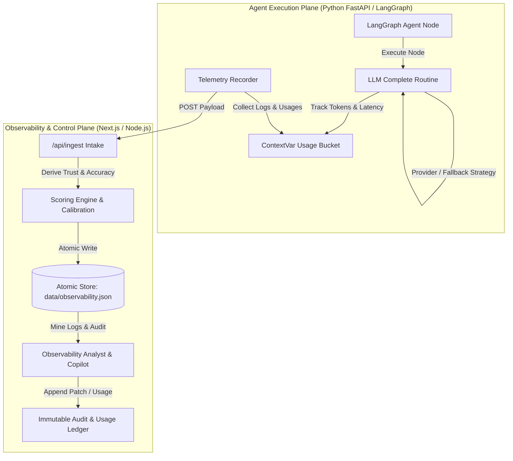
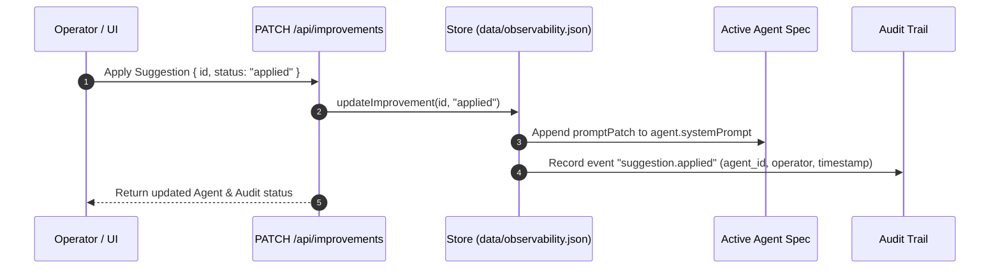

# Model Governance, Token Telemetry, & Code Usage Architecture — Northstar Observability

This document details the **Model Governance**, **Token Telemetry**, **Cost Accounting**, and **Code Usage Tracking** capabilities implemented in Northstar Agent-Ops. It provides a complete technical reference covering control plane policies, execution guardrails, multi-provider model routing, token allocation engines, audit ledgers, and codebase file mappings.

---

## 1. Executive Summary & Design Goals

Northstar implements a dual-layer architecture combining an **Agent Execution Plane** (LangGraph runtime) with an **Observability & Meta-AI Control Plane** (Next.js platform). To ensure safety, predictability, cost control, and accountability across LLM agent operations, the platform enforces strict model governance policies alongside granular token and latency telemetry.



### Core Governance Objectives
1. **Safety & Policy Guardrails**: Enforce deterministic fallback paths, timeout limits, SQL injection checks, and citation requirements.
2. **Audited System Prompt Patching**: Track, review, apply, and audit every change to an agent's system prompt.
3. **Multi-Model Routing & Resiliency**: Intelligently route between Gemini, OpenAI, and local heuristic fallback models based on key availability and execution health.
4. **Dual-Track Token & Cost Accounting**: Separate operational agent execution spend from platform Meta-AI spend (copilot, analyst log-mining, prompt refinement).
5. **Multi-Dimensional Quality & Trust Scoring**: Compute objective trust scores based on accuracy, confidence calibration, and historical reliability.

---

## 2. Model Governance Architecture & Control Plane

> [!IMPORTANT]
> Model governance in Northstar is not passive reporting; it actively controls execution safety, system prompt mutations, model fallbacks, and rate boundaries.

### 2.1 System Prompt Governance & Audited Patching

System prompts define agent behavior. Northstar treats system prompts as versioned governance assets:

- **Execution-Time Snapshots**: Every ingested trace records an immutable snapshot of the exact `systemPrompt` used during execution ([src/lib/store.ts](file:///c:/Users/LuC/Downloads/agent-ops/src/lib/store.ts#L330-L360)).
- **Automated Suggestion Lifecycle**: The Observability Analyst mines error logs and generates structured prompt improvement cards (`category: "prompt"`).
- **Audited Mutation Flow**: When an operator accepts a prompt fix via `PATCH /api/improvements` ([src/app/api/improvements/route.ts](file:///c:/Users/LuC/Downloads/agent-ops/src/app/api/improvements/route.ts#L20-L50)):
  1. The improvement status transitions to `"applied"`.
  2. The prompt patch is appended directly to the active agent's `systemPrompt` in `data/observability.json`.
  3. An immutable audit record (`action: "suggestion.applied"`) is written to the audit log.



### 2.2 Multi-Model Routing & Provider Resiliency

LLM completions go through `complete()` in [agents/app/llm.py](file:///c:/Users/LuC/Downloads/agent-ops/agents/app/llm.py#L60-L92), which implements a provider fallback strategy:

```
┌────────────────────────────────────────────────────────────────────────┐
│                        MODEL ROUTING STRATEGY                          │
├─────────────────┬──────────────────────┬───────────────────────────────┤
│ Condition       │ Primary Model        │ Fallback / Degraded Model     │
├─────────────────┼──────────────────────┼───────────────────────────────┤
│ GEMINI_API_KEY  │ ChatGoogleGenerativeAI│ Local Heuristic Pack          │
│ configured      │ (gemini-2.5-flash)   │ (used on timeout or exception)│
├─────────────────┼──────────────────────┼───────────────────────────────┤
│ OPENAI_API_KEY  │ ChatOpenAI           │ Local Heuristic Pack          │
│ configured      │ (gpt-4o-mini)        │ (used on timeout or exception)│
├─────────────────┼──────────────────────┼───────────────────────────────┤
│ No API Keys Set │ Local Deterministic  │ Local Deterministic           │
│ (Offline Mode)  │ Fallback Pack        │ Fallback Pack                 │
└─────────────────┴──────────────────────┴───────────────────────────────┘
```

- **Execution Timeout Control**: All external LLM API calls are bounded by `LLM_TIMEOUT_S` (default **25 seconds**). Calls run inside a dedicated `ThreadPoolExecutor(max_workers=4)`. If the LLM exceeds 25 seconds or throws an error, execution gracefully degrades to the fallback text without crashing the agent pipeline.
- **Fallback Flagging**: Any invocation using fallback text explicitly records `"fallback": true` and `"provider": "local"` in telemetry.

### 2.3 System Execution Limits & Bounds

To prevent memory leaks, runaway loops, and buffer bloat, system limits are centralized in `LIMITS` ([src/lib/limits.ts](file:///c:/Users/LuC/Downloads/agent-ops/src/lib/limits.ts#L1-L10)):

| Limit Property | Bound Value | Purpose & Enforcement |
| --- | --- | --- |
| `maxRequestChars` | 12,000 chars | Caps incoming prompt request payload size |
| `maxResponseChars` | 32,000 chars | Caps agent response string stored in memory/disk |
| `maxTraces` | 800 traces | Maximum execution traces retained in ring buffer |
| `maxLogs` | 200 logs | Maximum log events per trace |
| `maxAudit` | 2,000 entries | Retained immutable audit log records |
| `maxUsages` | 2,000 records | Retained AI model call and token usage records |
| `maxCopilotTurns` | 80 turns | Retained conversational turns in Copilot history |
| `staleHeartbeatMs` | 45,000 ms | Threshold after which agents are marked **offline** |

### 2.4 Agent Safety Checkers & Specialized Policy Rules

Each agent compiled in the Python runtime enforces domain-specific governance checks:

- **Atlas (Research Agent)**: Enforces citation checking. The score node penalizes research outputs lacking `source_id` references or citations, and the analyst generates prompt patches when citations are missing ([src/lib/observability-agent.ts](file:///c:/Users/LuC/Downloads/agent-ops/src/lib/observability-agent.ts#L83-L97)).
- **Helix (Support Policy Agent)**: Enforces strict refund rules. Automatically rejects unverified refund requests and penalizes policy breaches.
- **Forge (Code Review Agent)**: Evaluates SQL safety. Detects raw SQL string interpolation (`SELECT ... + var`) and flags high residual risk.
- **Sentinel (Incident Runbook Agent)**: Resilience fallback node. If input contains `timeout` or `18:10`, Sentinel reroutes to a fallback node with cached SLO metrics, producing a **degraded ok** status rather than a hard failure.

### 2.5 Trust & Quality Scoring Framework

Northstar calculates an objective **Trust Score** for every execution trace using a weighted composite formula ([src/lib/scoring.ts](file:///c:/Users/LuC/Downloads/agent-ops/src/lib/scoring.ts#L50-L75)):

$$\text{Trust} = 0.40 \times \text{Accuracy} + 0.30 \times \text{Confidence} + 0.30 \times \text{Reliability}$$

```
┌────────────────────────────────────────────────────────────────────────────────┐
│                           TRUST SCORE COMPONENTS                               │
├──────────────┬────────┬────────────────────────────────────────────────────────┤
│ Metric       │ Weight │ Operational Derivation Rules                           │
├──────────────┼────────┼────────────────────────────────────────────────────────┤
│ Accuracy     │ 40%    │ Prefers score node value. Otherwise estimated from     │
│              │        │ response length, structural completeness, and hedge    │
│              │        │ word penalties. Errors forced near ~20.                 │
├──────────────┼────────┼────────────────────────────────────────────────────────┤
│ Confidence   │ 30%    │ Prefers score node reported value. Error runs collapse │
│              │        │ confidence near ~22.                                   │
├──────────────┼────────┼────────────────────────────────────────────────────────┤
│ Reliability  │ 30%    │ Calculated from the agent's last 25 traces success     │
│              │        │ rate. Failed runs multiply reliability by 0.35.        │
└──────────────┴────────┴────────────────────────────────────────────────────────┘
```

> [!NOTE]
> **Calibration Gap Control**: If \(\text{Confidence} - \text{Accuracy} > 12\), the Observability Analyst flags a **Calibration Gap**, prompting confidence capping to prevent over-confident hallucinatory outputs.

### 2.6 Immutable Audit Ledger

All administrative, system, and operator interactions are recorded in an immutable ledger accessible via `GET /api/audit` ([src/app/api/audit/route.ts](file:///c:/Users/LuC/Downloads/agent-ops/src/app/api/audit/route.ts#L1-L15)):

- `agent.invoke`: Triggered whenever an agent playground or API invocation occurs.
- `suggestion.applied`: Triggered when an operator approves a prompt patch.
- `suggestion.dismissed`: Triggered when a suggestion is discarded.
- `copilot.question`: Triggered whenever an operator queries the Copilot assistant.
- `analyst.run`: Triggered when manual log-mining analysis is executed.

---

## 3. Code Usage, Token Telemetry, & Cost Accounting

### 3.1 Per-Node Token & Latency Telemetry

During execution, token consumption is recorded per Graph node using a thread-safe Python `ContextVar` bucket ([agents/app/llm.py](file:///c:/Users/LuC/Downloads/agent-ops/agents/app/llm.py#L13-L25)):

1. At the beginning of an agent invocation, `bind_usage_bucket()` initializes a fresh context list `_USAGE`.
2. Each call to `complete(system, user, fallback, node=...)` computes:
   $$\text{Prompt Tokens} = \max\left(1, \left\lfloor\frac{\text{len}(\text{system} + \text{user}) + 3}{4}\right\rfloor\right)$$
   $$\text{Completion Tokens} = \max\left(1, \left\lfloor\frac{\text{len}(\text{response}) + 3}{4}\right\rfloor\right)$$
3. The resulting usage item containing `ts`, `purpose`, `model`, `node`, `promptTokens`, `completionTokens`, `latencyMs`, `fallback`, and `provider` is appended to the context bucket.
4. When the graph completes, `Recorder.ingest()` aggregates total tokens across all node usages and POSTs the payload to `/api/ingest` ([agents/app/telemetry.py](file:///c:/Users/LuC/Downloads/agent-ops/agents/app/telemetry.py#L54-L96)).

### 3.2 Dual-Track AI Usage Accounting

Northstar maintains strict separation between **Operational Agent Spend** and **Platform Meta-AI Spend**:

```
                                  ┌─────────────────────────────┐
                                  │      AI USAGE ACCOUNTING    │
                                  └──────────────┬──────────────┘
                                                 │
                        ┌────────────────────────┴────────────────────────┐
                        ▼                                                 ▼
        ┌───────────────────────────────┐                 ┌───────────────────────────────┐
        │  Track A: Agent Execution     │                 │   Track B: Platform Meta-AI   │
        │  (LangGraph Fleet Ingest)     │                 │   (Dashboard Observability)   │
        ├───────────────────────────────┤                 ├───────────────────────────────┤
        │ • Agent nodes (plan, gather)  │                 │ • Analyst log-mining          │
        │ • Customer request processing │                 │ • Copilot assistant questions │
        │ • Ingested via /api/ingest    │                 │ • Prompt patch refinements    │
        │ • Rendered in /traces, /cost  │                 │ • Query via /api/ai/usage     │
        └───────────────────────────────┘                 └───────────────────────────────┘
```

#### Track B Endpoints (`/api/usage` & `/api/ai/usage`)
- `GET /api/usage` ([src/app/api/usage/route.ts](file:///c:/Users/LuC/Downloads/agent-ops/src/app/api/usage/route.ts#L1-L18)): Returns raw recorded usage logs, aggregated total tokens, total calls, and model breakdowns.
- `GET /api/ai/usage` ([src/app/api/ai/usage/route.ts](file:///c:/Users/LuC/Downloads/agent-ops/src/app/api/ai/usage/route.ts#L1-L45)): Formats dashboard Meta-AI metrics, timeseries call counts, fallback ratios, P50 latency, and call logs broken down by purpose (`copilot`, `analyst`, `summary`, `patch`).

### 3.3 Cost Allocation Engine & Pricing Models

Financial cost calculation is managed by the pricing engine in `src/lib/dash-state.ts` ([src/lib/dash-state.ts](file:///c:/Users/LuC/Downloads/agent-ops/src/lib/dash-state.ts#L16-L65)) and `src/lib/dash-gold.ts` ([src/lib/dash-gold.ts](file:///c:/Users/LuC/Downloads/agent-ops/src/lib/dash-gold.ts#L28-L38)):

```typescript
export interface PriceRow {
  id: string;
  model_prefix: string; // e.g. "gemini", "gpt", "default"
  input_cost: number;   // Cost in USD per 1M input tokens
  output_cost: number;  // Cost in USD per 1M output tokens
  active: boolean;
  updated_at: string;
}
```

#### Default Price Schedule (per 1,000,000 Tokens)
- **Gemini (`gemini*`)**: `$0.15` / 1M input tokens, `$0.60` / 1M output tokens
- **OpenAI (`gpt*`)**: `$0.15` / 1M input tokens, `$0.60` / 1M output tokens
- **Default Fallback**: `$0.50` / 1M input tokens, `$1.50` / 1M output tokens

#### Cost Calculation Formula
For any span or trace with input tokens \(T_{\text{in}}\) and output tokens \(T_{\text{out}}\):

$$\text{Cost}_{\text{USD}} = \left( \frac{T_{\text{in}}}{1,000,000} \times \text{Price}_{\text{in}} \right) + \left( \frac{T_{\text{out}}}{1,000,000} \times \text{Price}_{\text{out}} \right)$$

---

## 4. Code Base File & API Implementation Map

The table below maps all model governance, telemetry, cost accounting, and audit features directly to their location in the repository codebase:

| Feature / Governance Component | Primary File & Line Reference | Key Functions / Symbols |
| --- | --- | --- |
| **System Bounds & Limits** | [src/lib/limits.ts:1-10](file:///c:/Users/LuC/Downloads/agent-ops/src/lib/limits.ts#L1-L10) | `LIMITS` constant object |
| **LLM Routing & Fallback** | [agents/app/llm.py:60-92](file:///c:/Users/LuC/Downloads/agent-ops/agents/app/llm.py#L60-L92) | `complete()`, `_invoke()` |
| **Token Usage Context Bucket** | [agents/app/llm.py:13-25](file:///c:/Users/LuC/Downloads/agent-ops/agents/app/llm.py#L13-L25) | `bind_usage_bucket()`, `take_usage()`, `_USAGE` |
| **Telemetry Ingest & Recorder** | [agents/app/telemetry.py:32-96](file:///c:/Users/LuC/Downloads/agent-ops/agents/app/telemetry.py#L32-L96) | `Recorder.log()`, `Recorder.ingest()` |
| **Agent Registration & Heartbeat** | [agents/app/telemetry.py:98-113](file:///c:/Users/LuC/Downloads/agent-ops/agents/app/telemetry.py#L98-L113) | `register_agent()`, `heartbeat()` |
| **Trust Scoring Formula** | [src/lib/scoring.ts:50-75](file:///c:/Users/LuC/Downloads/agent-ops/src/lib/scoring.ts#L50-L75) | `computeTrustScore()`, `deriveAccuracy()`, `deriveConfidence()` |
| **Observability Analyst Engine** | [src/lib/observability-agent.ts:16-120](file:///c:/Users/LuC/Downloads/agent-ops/src/lib/observability-agent.ts#L16-L120) | `analyzeStore()`, `promptIssues()`, `recentErrors()` |
| **Copilot Chat Engine** | [src/lib/observability-agent.ts:150-250](file:///c:/Users/LuC/Downloads/agent-ops/src/lib/observability-agent.ts#L150-L250) | `answerCopilot()`, `llmAugmentDetailed()` |
| **Store & Audit Operations** | [src/lib/store.ts:200-280](file:///c:/Users/LuC/Downloads/agent-ops/src/lib/store.ts#L200-L280) | `recordAudit()`, `recordUsage()`, `updateImprovement()` |
| **Model Pricing Configuration** | [src/lib/dash-state.ts:16-65](file:///c:/Users/LuC/Downloads/agent-ops/src/lib/dash-state.ts#L16-L65) | `DashConfig`, `PriceRow`, `priceForModel()` |
| **Span & Metric Cost Engine** | [src/lib/dash-gold.ts:14-68](file:///c:/Users/LuC/Downloads/agent-ops/src/lib/dash-gold.ts#L14-L68) | `GoldSpan`, `GoldLog`, `GoldMetric` |
| **Ingest API Route** | [src/app/api/ingest/route.ts](file:///c:/Users/LuC/Downloads/agent-ops/src/app/api/ingest/route.ts) | `POST /api/ingest` |
| **Audit API Route** | [src/app/api/audit/route.ts](file:///c:/Users/LuC/Downloads/agent-ops/src/app/api/audit/route.ts) | `GET /api/audit` |
| **Usage API Routes** | [src/app/api/usage/route.ts](file:///c:/Users/LuC/Downloads/agent-ops/src/app/api/usage/route.ts), [src/app/api/ai/usage/route.ts](file:///c:/Users/LuC/Downloads/agent-ops/src/app/api/ai/usage/route.ts) | `GET /api/usage`, `GET /api/ai/usage` |
| **Improvements API Route** | [src/app/api/improvements/route.ts](file:///c:/Users/LuC/Downloads/agent-ops/src/app/api/improvements/route.ts) | `GET/PATCH /api/improvements` |

---

## 5. Control Room UI & Analytics Surfaces

Northstar provides five specialized dashboard views in `src/obs-ui/views/` for visualizing model governance, token telemetry, cost breakdown, and audit trails:

```
┌────────────────────────────────────────────────────────────────────────┐
│                     CONTROL ROOM UI SURFACES                           │
├─────────────────┬──────────────────────────────────────────────────────┤
│ UI View         │ Primary Governance & Usage Functionality             │
├─────────────────┼──────────────────────────────────────────────────────┤
│ /usage          │ Displays Dashboard Meta-AI call logs, fallback ratio │
│ (AiUsage.tsx)   │ chart, P50 latency, token counts, and purpose split. │
├─────────────────┼──────────────────────────────────────────────────────┤
│ /audit          │ Displays complete audit trail of agent invokes,      │
│ (Audit.tsx)     │ prompt patches applied, copilot turns, and analyst.  │
├─────────────────┼──────────────────────────────────────────────────────┤
│ /cost           │ Shows financial spend grouped by agent, service,     │
│ (AgentCost.tsx) │ project, and LLM model over configurable windows.    │
├─────────────────┼──────────────────────────────────────────────────────┤
│ /sessions       │ Displays top sessions ranked by token volume and USD │
│ (Sessions.tsx)  │ cost, with drilldown into trace spans.               │
├─────────────────┼──────────────────────────────────────────────────────┤
│ /admin          │ Configures user role access, project permissions,    │
│ (Admin.tsx)     │ and model pricing rates (input/output cost per 1M).  │
└─────────────────┴──────────────────────────────────────────────────────┘
```

---

## 6. Environment & Configuration Reference

Model governance behavior and provider routing are controlled via environment variables:

| Variable | Default Value | Description / Governance Purpose |
| --- | --- | --- |
| `GEMINI_API_KEY` | *(empty)* | Google Gemini API Key. Preferred LLM provider when present. |
| `GEMINI_MODEL` | `gemini-2.5-flash` | Gemini model variant targeted for agent completions. |
| `OPENAI_API_KEY` | *(empty)* | OpenAI API Key. Secondary provider used if Gemini is omitted. |
| `OPENAI_MODEL` | `gpt-4o-mini` | OpenAI model variant targeted for completions. |
| `LLM_TIMEOUT_S` | `25` | Maximum seconds allowed for an LLM call before timing out. |
| `OBSERVABILITY_URL` | `http://127.0.0.1:43147` | Base URL used by Python runtime to ingest traces. |
| `AGENTS_PORT` | `43148` | Port hosting the FastAPI LangGraph agent server. |
